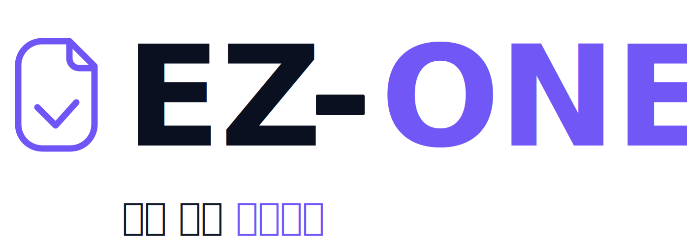

# EZ One

  

  <strong>쉽게 지원하자. 채용 공고부터 지원 준비까지 한 곳에서 관리하는 취업 준비 워크스페이스</strong>

## 프로젝트 소개

EZ One은 취업 준비자가 여러 채용 공고와 지원 준비 과정을 한 곳에서 관리할 수 있도록 돕는 서비스입니다.

채용 공고를 저장하고, 마감일과 지원 상태를 확인하며, 공고별 워크스페이스에서 자기소개서와 참고자료를 함께 정리할 수 있습니다. 반복해서 입력해야 하는 서류 정보도 재사용할 수 있어 지원 준비의 흐름을 놓치지 않도록 돕습니다.

## 이런 문제를 해결합니다

취업 준비를 하다 보면 공고 링크는 브라우저 북마크에, 마감일은 캘린더에, 자기소개서는 문서 파일에, 참고자료는 메모 앱에 흩어지기 쉽습니다.

EZ One은 이 정보를 공고 단위로 묶어 관리합니다. 사용자는 어떤 공고를 저장했는지, 어디까지 작성했는지, 다음에 무엇을 해야 하는지 한눈에 확인할 수 있습니다.

## 주요 기능

| 기능 | 설명 |
| --- | --- |
| 공고 저장 | 관심 있는 채용 공고를 저장하고 한 곳에서 관리합니다. |
| 공고 장바구니 | 저장한 공고의 마감일, 지원 상태, 준비 현황을 확인합니다. |
| 지원 워크스페이스 | 공고별 자기소개서, 참고자료, 지원 정보를 함께 관리합니다. |
| 서류 입력 정보 | 기본정보, 학력, 경력, 프로젝트 등 반복 입력 정보를 재사용합니다. |
| Chrome Extension | 채용 사이트에서 공고 정보를 확인하고 저장하는 흐름을 보조합니다. |
| Notion 연동 | 저장한 공고 정보를 Notion과 연결해 외부 워크스페이스에서도 확인할 수 있게 합니다. |

## 사용 시나리오

1. 관심 있는 채용 공고를 저장합니다.
2. 저장한 공고를 장바구니에서 확인합니다.
3. 공고별 워크스페이스에서 자기소개서를 작성합니다.
4. JD, 기업 정보, 뉴스, 메모 등 참고자료를 함께 정리합니다.
5. 자주 쓰는 서류 입력 정보를 재사용합니다.
6. 지원 준비 상태와 마감일을 관리합니다.

## 기술 스택

| 영역 | 스택 |
| --- | --- |
| Backend | Spring Boot, Spring MVC, Spring Security, JWT, MyBatis |
| Frontend | Vue 3, Vite, Vue Router, Pinia, Axios |
| Extension | Chrome Extension |
| Database | MySQL |
| External | Google OAuth2, Notion API |
| Deploy | AWS EC2 |

## 저장소 구조

| 경로 | 설명 |
| --- | --- |
| `backend/` | Spring Boot REST API, 인증/인가, DB, 외부 연동 |
| `frontend/` | Vue 3 웹 앱, 라우트, 페이지, 스토어, API 클라이언트 |
| `extension/` | Chrome Extension 팝업, 공고 추출, 미리보기, 저장 |
| `docs/` | 요구사항, 화면설계, API, ERD, 테스트 계획 등 구현 기준 문서 |
| `infra/` | 배포, 환경, 데이터베이스 설정, 운영 스크립트 |

## 개발 상태

현재 저장소는 개발 착수 전 스캐폴딩 단계입니다. 제품 요구사항과 구현 기준 문서를 정리했으며, 이후 `backend`, `frontend`, `extension` 앱을 순차적으로 구성할 예정입니다.

## 문서

| 목적 | 문서 |
| --- | --- |
| 요구사항 | [docs/04_requirements.md](./docs/04_requirements.md) |
| 화면 설계 | [docs/09_screen-design.md](./docs/09_screen-design.md) |
| API 명세 | [docs/13_api-spec.md](./docs/13_api-spec.md) |
| DB 설계 | [docs/12_erd.md](./docs/12_erd.md) |
| 테스트 계획 | [docs/21_test-plan.md](./docs/21_test-plan.md) |
| 기여 규칙 | [CONTRIBUTING.md](./CONTRIBUTING.md) |

## AUTH-001 Google 로그인 구현 기록

`feature/auth-google` 브랜치에서 P1 로그인 시작 흐름을 구현했다. 현재 범위는 `POST /api/auth/google` 성공 경로이며, Google OAuth code를 서버로 전달하면 Google token/userinfo API를 통해 사용자를 확인하고 EZ One access token과 refresh token을 발급한다.

### 구현 범위

- 프론트엔드: `frontend/src/features/auth/api/authApi.ts`에서 `POST /api/auth/google` API 클라이언트를 제공한다.
- 백엔드 컨트롤러: `AuthController`가 Google 로그인 요청을 받고 공통 응답 envelope로 토큰 응답을 반환한다.
- Google OAuth: `GoogleOAuthRestClient`가 Google token endpoint와 userinfo endpoint를 호출한다.
- 사용자 저장: `UserAccountMapper`가 `users` 테이블에서 Google provider 사용자를 조회하고, 없으면 생성한다.
- 토큰 발급: `JwtAuthTokenIssuer`가 access token과 refresh token을 발급한다.
- 세션 저장: refresh token 원문은 저장하지 않고 SHA-256 hash만 `user_sessions.refresh_token_hash`에 저장한다.

### 필요한 환경변수

| 이름 | 설명 |
| --- | --- |
| `GOOGLE_CLIENT_ID` | Google OAuth 클라이언트 ID |
| `GOOGLE_CLIENT_SECRET` | Google OAuth 클라이언트 secret |
| `JWT_ACCESS_SECRET` | access token 서명 secret |
| `JWT_REFRESH_SECRET` | refresh token 서명 secret |
| `DB_URL` | MySQL JDBC URL |
| `DB_USERNAME` | MySQL 사용자 |
| `DB_PASSWORD` | MySQL 비밀번호 |

### DB 전제

현재 구현은 아래 컬럼을 기준으로 동작한다.

- `users`: `id`, `email`, `provider`, `provider_id`, `created_at`
- `user_sessions`: `user_id`, `refresh_token_hash`, `expires_at`, `created_at`

### 검증

- 백엔드 `mvn test`: 5개 테스트 통과
- 프론트엔드 `npm run test`: 2개 테스트 통과
- 프론트엔드 `npm run build`: 통과
- backend secret 패턴 검색: 매칭 없음

### 후속 작업

- `POST /api/auth/refresh`
- `POST /api/auth/logout`
- `GET /api/me`
- 실제 DB schema 또는 migration SQL 고정
