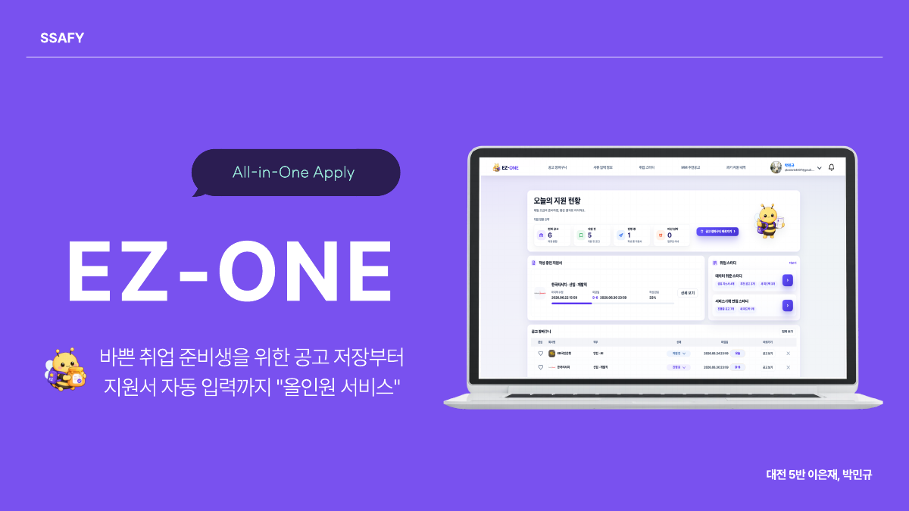
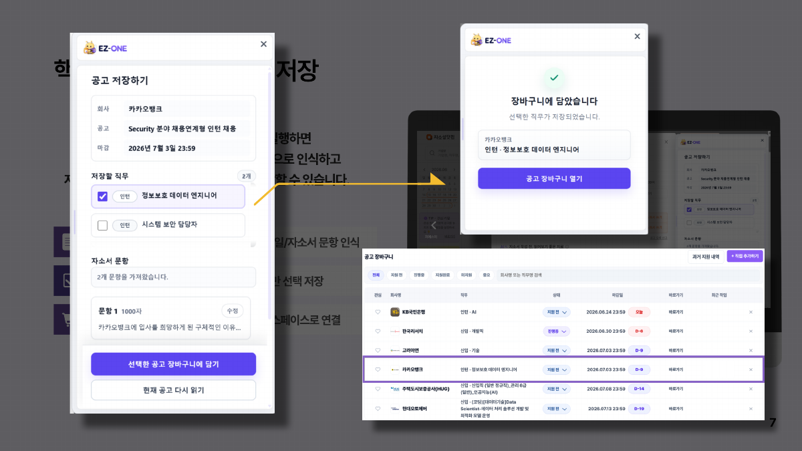

<p align="center">
  
</p>

# EZ-ONE

<p align="center">취업 준비 워크스페이스 · Spring Boot · Vue 3 · Chrome Extension · MySQL</p>

<p align="center">
  <strong>채용 공고 저장부터 자기소개서 준비까지 한곳에서 관리하는 취업 준비 워크스페이스</strong>
</p>

[](./backend)
[](./frontend)
[](./extension)
[](./docs/37_final-submission-report.md)

<p align="center">
  <a href="https://ez-one.o-r.kr/">서비스 바로가기</a> ·
  <a href="https://chromewebstore.google.com/detail/ez-one-job-saver/oamnhdoaefndncadifgaidefcjaomgdo?hl=ko">Chrome Web Store에서 확장 프로그램 설치</a>
</p>

<p align="center">
  
</p>

<p align="center"><sub>최종 발표자료에 수록된 실제 서비스 대시보드 화면</sub></p>

## 프로젝트 한눈에 보기

| 항목 | 내용 |
| --- | --- |
| 문제 | 채용 공고, 자기소개서 초안, 반복 입력 서류 정보가 여러 서비스에 흩어져 지원 준비 맥락이 끊기는 문제 |
| 해결 | 공고를 중심으로 공고 저장 → 장바구니 → 워크스페이스 → 자기소개서·참고자료·서류 정보 → Notion 동기화를 연결 |
| 팀 | 이은재 · 박민규 (2명) |
| 핵심 구현 | Spring Boot API, Vue SPA, Chrome Extension, MySQL/Flyway, Google OAuth, Notion `JOB_ONLY` 동기화 |
| 검증 | 최신 로컬 릴리즈 게이트 기준 Backend 231개, Frontend 244개, Extension 320개 테스트 통과. 운영 배포는 별도 외부 증거가 필요한 No-go 상태 |
| 발표 자료 | [최종 발표 PDF](./docs/presentations/ez-one-final-presentation.pdf) · [PPTX](./docs/presentations/ez-one-final-presentation.pptx) |

## 프로젝트 소개

EZ-ONE은 취업 준비자가 여러 채용 공고와 지원 준비 과정을 공고 단위로 관리할 수 있도록 만든 서비스입니다.

사용자는 관심 공고를 저장하고, 공고별 워크스페이스에서 자기소개서 문항, 초안, 참고자료, 기업 정보, 반복 입력하는 서류 정보를 함께 관리할 수 있습니다. Chrome Extension은 지원 사이트에서 공고를 빠르게 저장하고, 저장된 문서 프로필을 지원 페이지 입력 보조에 사용할 수 있게 합니다.

이 저장소는 최종 제출 기능, 아키텍처, 요구사항 추적, 테스트 근거, 발표 자료를 함께 확인할 수 있도록 정리한 포트폴리오 버전입니다.

## 포트폴리오 리뷰 경로

| 먼저 볼 것 | 확인할 내용 |
| --- | --- |
| [docs/presentations/ez-one-final-presentation.pdf](./docs/presentations/ez-one-final-presentation.pdf) | 프로젝트 문제 정의, 서비스 흐름, 최종 발표 요약 |
| [docs/37_final-submission-report.md](./docs/37_final-submission-report.md) | 최종 제출 범위, 구현 결과, 검증 요약 |
| [docs/16_system-architecture.md](./docs/16_system-architecture.md) | 백엔드, 프론트엔드, 확장 프로그램, 외부 API 연동 구조 |
| [docs/13_api-spec.md](./docs/13_api-spec.md) | REST API 명세와 요청/응답 구조 |
| [docs/23_traceability.md](./docs/23_traceability.md) | 요구사항과 구현/검증 산출물 연결 |

## 설계 의도

- **공고 단위 워크스페이스**: 채용 공고와 자기소개서, 참고자료, 반복 입력 정보를 한 맥락에서 관리합니다.
- **입력 반복 최소화**: 문서 프로필과 Chrome Extension을 이용해 사용자가 반복 입력하는 지원 정보를 재사용합니다.
- **근거 기반 준비**: 공고별 JD, 뉴스, DART, 인재상 정보를 연결해 자기소개서 작성의 참고 맥락을 남깁니다.

## 핵심 흐름

```text
Google 로그인 → 온보딩 → 공고 저장 → 장바구니 → 지원 워크스페이스
→ 자기소개서·참고자료·서류 정보 → Notion JOB_ONLY 동기화
```

<p align="center">
  
</p>

<p align="center"><sub>최종 발표자료에 수록된 실제 Chrome Extension 공고 저장·장바구니 연동 흐름</sub></p>

현재 배포 준비 기준은 위 P1 흐름입니다. 문서에 남아 있는 P2/IA 기능은 명시적으로 승인되기 전까지 운영 기능으로 홍보하거나 활성화하지 않습니다.

## 발표 자료

| 자료 | 설명 |
| --- | --- |
| [최종 발표 PDF](./docs/presentations/ez-one-final-presentation.pdf) | GitHub에서 바로 열어볼 수 있는 발표 자료 |
| [최종 발표 PPTX](./docs/presentations/ez-one-final-presentation.pptx) | 편집 가능한 원본 발표 파일 |

## 팀과 담당 역할

최종 발표자료의 역할 분담을 기준으로 정리했습니다.

| 구성원 | 담당 기능 |
| --- | --- |
| 이은재 | 기획 문서 작성, 공고 장바구니·지원 상태 관리, 워크스페이스·자소서 버전 관리, 참고자료·서류 정보 관리, 대시보드·취업 스터디 구현 |
| 박민규 | 설계 문서 작성, 로그인·온보딩, Mattermost 추천 공고, 서류 자동 입력·Chrome Extension, Notion·마이페이지, 과거 지원 내역 구현 |

## 주요 기능

| 영역 | 내용 |
| --- | --- |
| 인증/계정 | Google OAuth 로그인, JWT access token, HttpOnly refresh cookie, 로그아웃, 현재 사용자 조회/수정 |
| 온보딩/마이페이지 | 희망 직무, 기업 유형, 역량, 기술 스택, SSAFY 여부 등 사용자 프로필 관리 |
| 메인 대시보드 | 지원 현황 요약, 상태 카드, 작성 중 지원서, 공고 바구니 이동 |
| 공고 바구니 | 직접 입력 또는 Chrome Extension으로 저장한 공고 목록, 검색/정렬/상태 변경, 삭제/복구 |
| 워크스페이스 | 공고 기본 정보, 자기소개서 문항/초안, 자동 저장, 버전 생성/비교 |
| 참고자료 | JD, 뉴스, DART, 인재상, 자유 메모 등 공고별 참고자료 CRUD |
| 문서 프로필 | 기본 정보, 학력, 경력, 프로젝트, 자격증, 수상/교육 등 반복 입력 정보 관리 |
| Chrome Extension | 지원 사이트 공고 추출, 미리보기, 직무 선택, 공고 저장, 로그인 오류 안내 |
| Extension 입력 보조 | 저장된 문서 프로필을 지원 페이지 입력칸에 사용자가 실행하는 방식으로 자동 입력 |
| Notion 연동 | Notion OAuth 연결, `JOB_ONLY` 범위 공고 동기화, 동기화 로그 |

## 기술 스택

| 영역 | 기술 |
| --- | --- |
| Backend | Spring Boot, Spring MVC, Spring Security, JWT, MyBatis |
| Frontend | Vue 3, Vite, Vue Router, Pinia, Axios |
| Extension | Chrome Extension, Vite |
| Database | MySQL, Flyway |
| External | Google OAuth2, Notion API |
| Deploy | AWS EC2, Nginx, systemd |

## 저장소 구조

| 경로 | 설명 |
| --- | --- |
| `backend/` | Spring Boot REST API, 인증/인가, MyBatis mapper, 외부 API 연동 |
| `frontend/` | Vue 3 앱, 라우터, Pinia store, API client, 화면 컴포넌트 |
| `extension/` | Chrome Extension popup, content script, 공고 추출과 입력 보조 |
| `docs/` | 요구사항, 화면 설계, API 명세, ERD, 테스트 계획, 최종 제출 보고서, 발표 자료, 릴리즈 문서 |
| `infra/` | EC2, systemd, Nginx 배포/운영 설정 |
| `scripts/` | 로컬 검증, 보안/환경 검사, artifact packaging, deploy/rollback/canary 보조 스크립트 |
| `tools/` | 로컬 개발, 데이터 수집, 검증 보조 스크립트 |

## 로컬 실행

### Backend

```powershell
cd backend
.\mvnw.cmd spring-boot:run
```

### Frontend

```powershell
cd frontend
npm install
npm run dev
```

### Chrome Extension

```powershell
cd extension
npm install
npm run build:local
```

빌드 후 Chrome에서 `chrome://extensions`를 열고 개발자 모드를 켠 뒤 `extension/dist`를 로드합니다. 운영 배포용 zip은 `npm run package` 또는 릴리즈 artifact packaging 스크립트로 만듭니다.

## 검증과 배포

전체 릴리즈 검증은 다음 명령으로 실행합니다.

```powershell
.\scripts\release-local-gate.ps1
```

실제 배포 전에는 릴리즈 증적 파일의 공백을 먼저 확인합니다.

```powershell
.\scripts\show-release-evidence-gaps.ps1 -EvidenceFile .\release-artifacts\<release-id>\release-evidence.json
```

이 보고서는 `Suggested next commands`와 `First next command`를 출력해, 누락된 증적을 채운 뒤에만 최종 Go/No-go 판단으로 넘어가도록 안내합니다.

로컬 실행, 배포 절차, 운영 검증 기준은 별도 문서로 분리했습니다.

- [릴리즈 준비 QA](./docs/38_release-readiness-qa.md)
- [첫 배포 가이드](./docs/42_first-deployment-ko.md)
- [운영 배포 런북](./docs/39_production-deployment-runbook.md)

### 검증 근거

2026-06-30 최신 로컬 릴리즈 게이트에서 다음을 확인했습니다. 이는 로컬 코드·패키징 검증 결과이며, 실제 운영 배포 완료를 뜻하지 않습니다.

| 영역 | 확인 결과 |
| --- | --- |
| Backend | 231 tests · 실패 0 · 오류 0 · skip 2 · 패키징 통과 |
| Frontend | 39 files · 244 tests · production build 통과 |
| Chrome Extension | 16 files · 320 tests · production/local build 통과 |
| 운영 배포 | EC2, 운영 환경 변수, DB 복구 리허설, 실제 연동 smoke, canary 증거가 없어 No-go 유지 |

## 공개 범위와 제한

- 실제 `.env`, token, OAuth secret, API key, 개인 데이터는 저장소에 포함하지 않습니다.
- 설계 문서에만 남은 기능은 현재 구현 기능으로 소개하지 않습니다.
- 운영 배포 여부는 릴리즈 문서와 검증 결과를 기준으로 확인합니다.
- README의 화면은 실제 최종 발표자료에서 추출한 이미지이며, 임의로 생성한 이미지를 사용하지 않습니다.

## 주요 문서

| 목적 | 문서 |
| --- | --- |
| 요구사항 | [docs/04_requirements.md](./docs/04_requirements.md) |
| 화면 설계 | [docs/09_screen-design.md](./docs/09_screen-design.md) |
| 기능 명세 | [docs/10_feature-spec.md](./docs/10_feature-spec.md) |
| ERD | [docs/12_erd.md](./docs/12_erd.md) |
| API 명세 | [docs/13_api-spec.md](./docs/13_api-spec.md) |
| 테스트 계획 | [docs/21_test-plan.md](./docs/21_test-plan.md) |
| 요구사항 추적 | [docs/23_traceability.md](./docs/23_traceability.md) |
| 기술 스택/로컬 개발 | [docs/17_tech-stack-and-local-development.md](./docs/17_tech-stack-and-local-development.md) |
| 첫 배포 한국어 실행 가이드 | [docs/42_first-deployment-ko.md](./docs/42_first-deployment-ko.md) |
| 배포 초보자 가이드 | [docs/41_beginner-deployment-guide.md](./docs/41_beginner-deployment-guide.md) |
| 운영 배포 런북 | [docs/39_production-deployment-runbook.md](./docs/39_production-deployment-runbook.md) |
