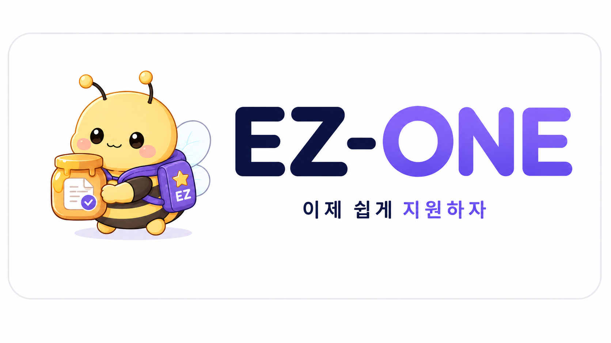

# EZ-ONE

<p align="center">
  
</p>

<p align="center">
  <strong>채용 공고 저장부터 자기소개서 준비까지 한곳에서 관리하는 취업 준비 워크스페이스</strong>
</p>

## 프로젝트 소개

EZ-ONE은 취업 준비자가 여러 채용 공고와 지원 준비 과정을 공고 단위로 정리할 수 있도록 돕는 서비스입니다.

채용 공고를 저장하고, 마감일과 지원 상태를 확인하며, 공고별 워크스페이스에서 자기소개서와 참고자료를 함께 관리합니다. 반복해서 입력해야 하는 학력, 경력, 프로젝트, 자격증 같은 서류 정보도 한 번 정리해 재사용할 수 있습니다.

## 해결하려는 문제

취업 준비를 하다 보면 정보가 쉽게 흩어집니다.

- 공고 링크는 브라우저 북마크나 메신저에 흩어집니다.
- 마감일은 캘린더나 메모장에 따로 적게 됩니다.
- 자기소개서는 문서 파일마다 분리됩니다.
- 기업 조사, JD, 뉴스, DART 자료는 별도 탭과 메모 앱에 쌓입니다.
- 반복 입력해야 하는 서류 정보는 매번 다시 찾게 됩니다.

EZ-ONE은 이 흐름을 공고 중심으로 묶어, 어떤 공고를 저장했고 어디까지 준비했으며 다음에 무엇을 해야 하는지 한눈에 볼 수 있게 합니다.

## 핵심 사용자 흐름

```text
Google 로그인 -> 온보딩 -> 메인 -> 공고 저장 -> 공고함 -> 지원 워크스페이스 -> 자기소개서/참고자료/서류 정보 관리 -> Notion 동기화
```

## 주요 기능

| 기능 | 설명 |
| --- | --- |
| 공고 저장 | 관심 있는 채용 공고를 저장하고 중복 저장을 방지합니다. |
| 공고함 | 저장한 공고의 마감일, 지원 상태, 준비 현황을 관리합니다. |
| 지원 워크스페이스 | 공고별 자기소개서, 참고자료, 지원 메모를 한곳에서 관리합니다. |
| 서류 입력 정보 | 학력, 경력, 프로젝트, 자격증 등 반복 입력 정보를 정리해 재사용합니다. |
| Chrome Extension | 채용 사이트에서 공고 정보를 추출하고 미리보기 후 저장합니다. |
| Notion 동기화 | 저장한 공고 정보만 Notion으로 동기화합니다. |
| 과거 지원 이력 | 지원 상태가 바뀐 공고와 가져온 이력을 기간, 결과, 기업 유형으로 확인합니다. |
| 취업 스터디 | 스터디 구성원끼리 자소서와 피드백을 공유합니다. |
| SSAFY 추천 공고 | SSAFY 사용자에게 Mattermost 기반 추천 공고 목록을 제공합니다. |

## 현재 개발 상태

현재는 백엔드 API, 프론트엔드 화면, Chrome Extension, 테스트, 제출용 빌드 산출물이 준비된 상태입니다.

핵심 제출 범위는 Google 로그인, 온보딩, 메인 대시보드, 공고 저장/공고함, 지원 워크스페이스, 참고자료, 서류 입력 정보, Chrome Extension 공고 저장, Notion `JOB_ONLY` 동기화입니다. 구현된 확장 범위로 과거 지원 이력, 취업 스터디, SSAFY 전용 Mattermost 추천, DART 기반 참고자료 분석 보조가 포함되어 있습니다.

알림 독립 채널, 외부 캘린더 연동, 관리자 운영 화면, 자소서/도화지 Notion 확장 동기화, AI의 자동 자소서 수정은 제출 범위에 포함하지 않습니다. 자세한 최종 범위와 검증 결과는 [docs/37_final-submission-report.md](./docs/37_final-submission-report.md)를 참고합니다.

## 기술 스택

| 영역 | 스택 |
| --- | --- |
| Backend | Spring Boot, Spring MVC, Spring Security, JWT, MyBatis |
| Frontend | Vue 3, Vite, Vue Router, Pinia, Axios |
| Extension | Chrome Extension |
| Database | MySQL |
| External | Google OAuth2, Notion API |
| Deploy | AWS EC2 |

## 저장소 구조

| 경로 | 설명 |
| --- | --- |
| `backend/` | Spring Boot REST API, 인증/인가, DB, 외부 연동 |
| `frontend/` | Vue 3 프론트엔드, 라우터, API 클라이언트, 상태 관리 |
| `extension/` | Chrome Extension 팝업, 공고 추출, 미리보기, 저장 |
| `docs/` | 요구사항, 화면 설계, API, ERD, 테스트 계획, 작업 문서 |
| `infra/` | 배포, 환경, 운영 스크립트 |

## 문서

| 목적 | 문서 |
| --- | --- |
| 요구사항 | [docs/04_requirements.md](./docs/04_requirements.md) |
| 최종 제출 보고서 | [docs/37_final-submission-report.md](./docs/37_final-submission-report.md) |
| 전체 IA | [docs/08_information-architecture.md](./docs/08_information-architecture.md) |
| 화면 설계 | [docs/09_screen-design.md](./docs/09_screen-design.md) |
| 기능 명세 | [docs/10_feature-spec.md](./docs/10_feature-spec.md) |
| API 명세 | [docs/13_api-spec.md](./docs/13_api-spec.md) |
| DB 설계 | [docs/12_erd.md](./docs/12_erd.md) |
| 테스트 계획 | [docs/21_test-plan.md](./docs/21_test-plan.md) |
| 작업 계획 | [docs/18_wbs.md](./docs/18_wbs.md) |
| 협업 규칙 | [docs/30_team-collaboration-workflow.md](./docs/30_team-collaboration-workflow.md) |
