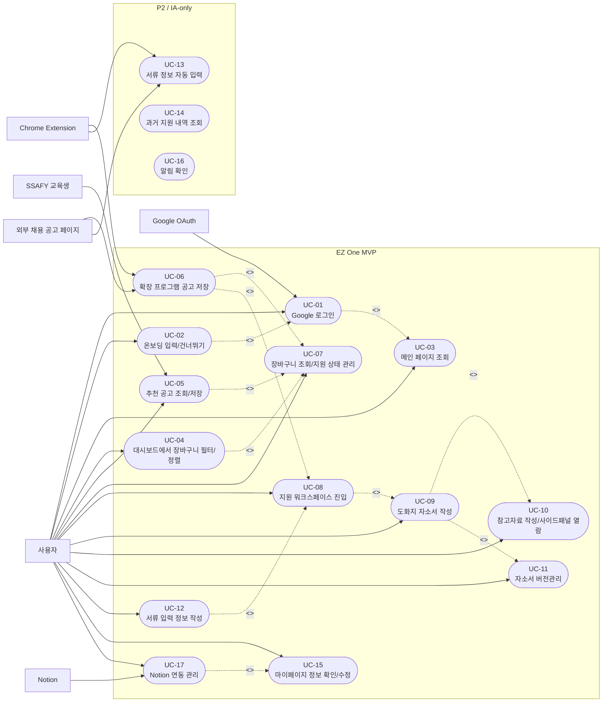

# EZ-ONE MVP 유즈케이스 명세서

이 문서는 유즈케이스 다이어그램과 상세 유즈케이스 명세를 함께 관리한다. 다이어그램은 액터와 기능 범위를 빠르게 확인하기 위한 요약이고, UC-01~UC-17 표는 구현과 테스트에 필요한 상세 흐름이다.

## 유즈케이스 다이어그램

## 다이어그램 참고사항

- GitHub/Notion Mermaid 호환을 위해 `flowchart` 문법으로 UML 유즈케이스 다이어그램 형태를 표현한다.
- 사각형은 액터/외부 시스템, 큰 박스는 EZ One 시스템 경계, 타원은 유즈케이스를 뜻한다.
- P1 구현 판단은 [04. 요구사항 정의서](04_requirements.md)와 [23. 요구사항 추적표](23_traceability.md)를 우선한다.
- UC-13, UC-14, UC-16은 IA에는 유지하지만 P1 완료 기준이 아니다.
- 아래 UC 상세 명세는 API, 화면, 테스트 설계 시 흐름 기준으로 사용한다.

## 상세 명세

## UC-01. Google 로그인

| 항목 | 내용 |
| --- | --- |
| 시스템 제목 | EZ-ONE MVP |
| 유즈케이스 이름 | Google 로그인 |
| 액터 | 사용자, Google OAuth |
| 시작 조건 | 사용자가 EZ-ONE 웹 서비스에 접속해 있어야 한다. |
| 기본 흐름 | 1. 사용자가 Google 로그인 버튼을 선택한다. 2. 시스템이 Google OAuth 인증 화면을 요청한다. 3. 사용자가 Google 계정으로 인증한다. 4. Google OAuth가 인증 결과를 시스템에 전달한다. 5. 시스템이 사용자 계정 정보를 확인한다. 6. 최초 로그인 여부를 확인한다. 7. 최초 로그인 사용자는 온보딩 모달로 이동한다. 8. 기존 사용자는 메인 페이지로 이동한다. |
| 대안 흐름 | 3A. 사용자가 Google 인증을 취소한다. 1. 시스템이 로그인 전 상태로 돌아간다.  4A. Google 인증에 실패한다. 1. 시스템이 로그인 실패 메시지를 표시한다. 2. 사용자는 다시 로그인을 시도할 수 있다. |
| 종료 조건 | 사용자가 로그인 상태가 되거나, 로그인 실패/취소 상태로 남는다. |

## UC-02. 온보딩 입력 또는 건너뛰기

| 항목 | 내용 |
| --- | --- |
| 시스템 제목 | EZ-ONE MVP |
| 유즈케이스 이름 | 온보딩 입력 또는 건너뛰기 |
| 액터 | 사용자 |
| 시작 조건 | 사용자가 최초 로그인 상태여야 한다. |
| 기본 흐름 | 1. 시스템이 온보딩 모달을 표시한다. 2. 사용자가 희망 직무를 입력한다. 3. 사용자가 희망 기업, 희망 지역, 보유 스킬을 입력한다. 4. 사용자가 SSAFY 교육생 여부를 선택한다. 5. 사용자가 시작하기 버튼을 선택한다. 6. 시스템이 온보딩 정보를 저장한다. 7. 시스템이 사용자를 메인 페이지로 이동시킨다. |
| 대안 흐름 | 1A. 사용자가 온보딩을 건너뛴다. 1. 시스템이 온보딩 정보를 저장하지 않는다. 2. 시스템이 사용자를 메인 페이지로 이동시킨다. 3. 사용자는 이후 마이페이지에서 온보딩 정보를 입력하거나 수정할 수 있다. |
| 종료 조건 | 사용자가 메인 페이지에 진입한다. 온보딩을 입력한 경우 해당 정보가 마이페이지에 저장된다. |

## UC-03. 메인 페이지 조회

| 항목 | 내용 |
| --- | --- |
| 시스템 제목 | EZ-ONE MVP |
| 유즈케이스 이름 | 메인 페이지 조회 |
| 액터 | 사용자 |
| 시작 조건 | 사용자가 로그인되어 있어야 한다. |
| 기본 흐름 | 1. 사용자가 메인 페이지에 진입한다. 2. 시스템이 대시보드 영역을 표시한다. 3. 시스템이 공고 장바구니 영역을 표시한다. 4. 시스템이 서류 입력 정보 영역을 표시한다. 5. 시스템이 추천 공고 영역을 표시한다. 6. 사용자는 원하는 영역을 선택한다. |
| 대안 흐름 | 2A. 표시할 공고 데이터가 없다. 1. 시스템이 빈 상태 메시지를 표시한다. 2. 시스템이 공고 저장 또는 추천 공고 확인을 유도한다. |
| 종료 조건 | 메인 페이지의 주요 영역이 표시되고, 사용자는 각 기능으로 이동할 수 있다. |

## UC-04. 대시보드 항목 클릭으로 공고 장바구니 필터링/정렬

| 항목 | 내용 |
| --- | --- |
| 시스템 제목 | EZ-ONE MVP |
| 유즈케이스 이름 | 대시보드 항목 클릭으로 공고 장바구니 필터링/정렬 |
| 액터 | 사용자 |
| 시작 조건 | 사용자가 메인 페이지에 있고, 공고 장바구니에 공고 데이터가 존재해야 한다. |
| 기본 흐름 | 1. 사용자가 메인 페이지의 대시보드를 확인한다. 2. 사용자가 대시보드 항목 중 하나를 선택한다. 3. 시스템이 공고 장바구니 페이지로 이동한다. 4. 시스템이 선택한 항목에 맞게 공고 목록을 필터링하거나 정렬한다. 5. 시스템이 조건이 반영된 공고 장바구니 목록을 표시한다. |
| 대안 흐름 | 2A. 사용자가 총 지원 항목을 선택한다. 1. 시스템이 전체 공고 목록을 표시한다.  2B. 사용자가 마감 임박 항목을 선택한다. 1. 시스템이 공고 목록을 마감 임박순으로 정렬한다.  2C. 사용자가 진행중 항목을 선택한다. 1. 시스템이 지원 상태가 진행중인 공고만 표시한다.  2D. 사용자가 지원 전 항목을 선택한다. 1. 시스템이 지원 상태가 지원 전인 공고만 표시한다. |
| 종료 조건 | 공고 장바구니가 선택한 조건에 맞게 표시된다. |

## UC-05. 추천 공고 조회 및 저장

| 항목 | 내용 |
| --- | --- |
| 시스템 제목 | EZ-ONE MVP |
| 유즈케이스 이름 | 추천 공고 조회 및 저장 |
| 액터 | 사용자 |
| 시작 조건 | 사용자가 로그인되어 있어야 한다. |
| 기본 흐름 | 1. 사용자가 메인 페이지의 추천 공고 영역을 선택한다. 2. 시스템이 추천 공고 페이지를 표시한다. 3. 시스템이 온보딩 정보를 기반으로 추천 공고 카드를 표시한다. 4. 사용자가 관심 공고의 별표를 선택한다. 5. 시스템이 해당 공고를 공고 장바구니에 저장한다. 6. 시스템이 저장 완료 상태를 표시한다. |
| 대안 흐름 | 3A. 사용자가 SSAFY 교육생이다. 1. 시스템이 일반 채용 플랫폼 추천 공고와 Mattermost 추천 공고를 함께 표시한다.  3B. 사용자가 SSAFY 교육생이 아니다. 1. 시스템이 일반 채용 플랫폼 추천 공고만 표시한다.  3C. 온보딩 정보가 없다. 1. 시스템이 기본 추천 공고를 표시하거나 온보딩 정보 입력을 유도한다. |
| 종료 조건 | 사용자가 추천 공고를 확인하거나, 관심 공고가 공고 장바구니에 저장된다. |

## UC-06. 확장 프로그램으로 공고 저장

| 항목 | 내용 |
| --- | --- |
| 시스템 제목 | EZ-ONE MVP |
| 유즈케이스 이름 | 확장 프로그램으로 공고 저장 |
| 액터 | 사용자, 브라우저 확장 프로그램, 외부 채용 공고 페이지 |
| 시작 조건 | 사용자가 로그인되어 있고 브라우저 확장 프로그램을 사용할 수 있어야 한다. |
| 기본 흐름 | 1. 사용자가 외부 채용 공고 페이지에 접속한다. 2. 사용자가 브라우저 확장 프로그램을 실행한다. 3. 사용자가 공고 저장하기 버튼을 선택한다. 4. 확장 프로그램이 현재 페이지의 공고 정보를 읽어온다. 5. 확장 프로그램이 공고 내 직무 정보를 확인한다. 6. 공고에 여러 직무가 있으면 직무 목록을 체크박스로 표시한다. 7. 사용자가 저장할 직무를 하나 이상 선택한다. 8. 사용자가 저장을 실행한다. 9. 시스템이 선택한 직무별 공고를 공고 장바구니에 저장한다. |
| 대안 흐름 | 5A. 공고에 직무가 하나만 있다. 1. 시스템이 직무 선택 단계를 생략하거나 단일 직무를 기본 선택한다.  4A. 공고 정보를 읽어오지 못한다. 1. 시스템이 공고 정보 감지 실패 메시지를 표시한다. 2. 사용자는 다시 시도하거나 수동 입력을 고려한다. |
| 종료 조건 | 선택한 공고가 공고 장바구니에 저장된다. |

## UC-07. 공고 장바구니 조회 및 지원 상태 관리

| 항목 | 내용 |
| --- | --- |
| 시스템 제목 | EZ-ONE MVP |
| 유즈케이스 이름 | 공고 장바구니 조회 및 지원 상태 관리 |
| 액터 | 사용자 |
| 시작 조건 | 공고 장바구니에 저장된 공고가 있어야 한다. |
| 기본 흐름 | 1. 사용자가 공고 장바구니 페이지에 진입한다. 2. 시스템이 공고 목록을 표시한다. 3. 사용자가 회사, 직무, 지원 상태, 마감일, 링크를 확인한다. 4. 사용자가 특정 공고의 지원 상태를 수정한다. 5. 시스템이 수정된 지원 상태를 저장한다. 6. 시스템이 대시보드와 알림 조건에 변경 사항을 반영한다. |
| 대안 흐름 | 2A. 저장된 공고가 없다. 1. 시스템이 빈 공고 장바구니 상태를 표시한다. 2. 시스템이 추천 공고 확인 또는 확장 프로그램 공고 저장을 유도한다. |
| 종료 조건 | 공고 목록이 표시되고, 수정된 지원 상태가 저장된다. |

## UC-08. 개별 지원 워크스페이스 진입

| 항목 | 내용 |
| --- | --- |
| 시스템 제목 | EZ-ONE MVP |
| 유즈케이스 이름 | 개별 지원 워크스페이스 진입 |
| 액터 | 사용자 |
| 시작 조건 | 공고 장바구니에 공고가 존재해야 한다. |
| 기본 흐름 | 1. 사용자가 공고 장바구니에서 특정 회사/직무 행을 선택한다. 2. 시스템이 개별 지원 워크스페이스로 이동한다. 3. 시스템이 지원 정보를 게시한다. 4. 시스템이 기업 정보를 게시한다. 5. 시스템이 하단 영역에 도화지와 자소서 버전관리 선택지를 표시한다. |
| 대안 흐름 | 3A. 지원 정보 일부가 없다. 1. 시스템이 가능한 정보만 표시한다. 2. 누락된 정보는 빈 상태 또는 입력 유도 상태로 표시한다. |
| 종료 조건 | 사용자가 개별 지원 워크스페이스에 진입하고, 지원 정보와 기업 정보를 확인할 수 있다. |

## UC-09. 도화지에서 자소서 작성

| 항목 | 내용 |
| --- | --- |
| 시스템 제목 | EZ-ONE MVP |
| 유즈케이스 이름 | 도화지에서 자소서 작성 |
| 액터 | 사용자 |
| 시작 조건 | 사용자가 개별 지원 워크스페이스에 진입해 있어야 한다. |
| 기본 흐름 | 1. 사용자가 하단 영역에서 도화지를 선택한다. 2. 시스템이 도화지 작성 화면을 표시한다. 3. 시스템이 참고자료 사이드패널을 함께 표시한다. 4. 사용자가 마크다운 형식으로 자기소개서를 작성한다. 5. 사용자가 문항별 내용을 작성한다. 6. 시스템이 글자수를 표시한다. 7. 시스템이 작성 내용을 저장한다. |
| 대안 흐름 | 7A. 저장에 실패한다. 1. 시스템이 저장 실패 메시지를 표시한다. 2. 사용자는 다시 저장을 시도할 수 있다. |
| 종료 조건 | 사용자가 작성한 자기소개서 내용이 저장된다. |

## UC-10. 참고자료 게시판 작성 및 사이드패널 열람

| 항목 | 내용 |
| --- | --- |
| 시스템 제목 | EZ-ONE MVP |
| 유즈케이스 이름 | 참고자료 게시판 작성 및 사이드패널 열람 |
| 액터 | 사용자 |
| 시작 조건 | 사용자가 개별 지원 워크스페이스에서 도화지를 선택해야 한다. |
| 기본 흐름 | 1. 시스템이 도화지 사이드패널을 표시한다. 2. 시스템이 참고자료 게시판 목록을 표시한다. 3. 사용자가 JD, DART, 인재상, 뉴스기사, 프롬프트, 메모, 수상/프로젝트 중 하나를 선택한다. 4. 시스템이 선택한 게시판 작성 화면을 표시한다. 5. 사용자가 이미지, 텍스트, 링크, 메모 등을 작성한다. 6. 사용자가 저장한다. 7. 시스템이 작성한 정보를 저장한다. 8. 사용자는 도화지 작성 중 사이드패널에서 저장 정보를 열람할 수 있다. |
| 대안 흐름 | 3A. 사용자가 수상/프로젝트 게시판을 선택한다. 1. 시스템이 메인 서류 입력 정보에 저장된 수상/프로젝트 정보를 확인한다. 2. 정보가 있으면 수상/프로젝트 게시판에 초기값으로 표시한다. 3. 정보가 없으면 빈 상태로 표시한다. 4. 사용자는 수상/프로젝트 정보를 수정하거나 추가할 수 있다. 5. 수정/추가한 내용은 메인 서류 입력 정보로 동기화되지 않는다. |
| 종료 조건 | 참고자료가 게시판별로 저장되고, 도화지 사이드패널에서 열람 가능하다. |

## UC-11. 자소서 버전관리 사용

| 항목 | 내용 |
| --- | --- |
| 시스템 제목 | EZ-ONE MVP |
| 유즈케이스 이름 | 자소서 버전관리 사용 |
| 액터 | 사용자 |
| 시작 조건 | 사용자가 개별 지원 워크스페이스에 진입해 있어야 한다. |
| 기본 흐름 | 1. 사용자가 하단 영역에서 자소서 버전관리를 선택한다. 2. 시스템이 자소서 버전관리 화면을 표시한다. 3. 시스템이 저장된 자소서 버전 목록을 표시한다. 4. 사용자가 특정 버전을 선택한다. 5. 사용자가 버전 내용을 확인하거나 비교한다. 6. 시스템이 변경 이력을 저장한다. |
| 대안 흐름 | 2A. 저장된 버전이 없다. 1. 시스템이 빈 버전 상태를 표시한다. 2. 사용자가 새 버전을 생성할 수 있도록 안내한다. |
| 종료 조건 | 사용자가 자소서 버전 목록과 변경 이력을 확인할 수 있다. |

## UC-12. 서류 입력 정보 작성

| 항목 | 내용 |
| --- | --- |
| 시스템 제목 | EZ-ONE MVP |
| 유즈케이스 이름 | 서류 입력 정보 작성 |
| 액터 | 사용자 |
| 시작 조건 | 사용자가 로그인되어 있어야 한다. |
| 기본 흐름 | 1. 사용자가 메인 페이지의 서류 입력 정보 영역을 선택한다. 2. 시스템이 서류 입력 정보 페이지를 표시한다. 3. 사용자가 학력, 어학, 자격증, 수상, 프로젝트, 경력 등의 정보를 입력한다. 4. 사용자가 필요한 경우 기업별 커스텀 항목을 추가한다. 5. 사용자가 포트폴리오 등 첨부파일을 등록한다. 6. 시스템이 입력 정보와 첨부파일을 저장한다. |
| 대안 흐름 | 4A. 사용자가 커스텀 항목을 추가하지 않는다. 1. 시스템은 기본 항목만 저장한다.  5A. 첨부파일 등록에 실패한다. 1. 시스템이 업로드 실패 메시지를 표시한다. 2. 사용자는 다시 업로드를 시도할 수 있다. |
| 종료 조건 | 서류 입력 정보가 저장되고, 워크스페이스 기본값으로 재사용될 수 있다. 확장 프로그램 자동 입력 활용은 P2다. |

## UC-13. 확장 프로그램으로 서류 정보 자동 입력

| 항목 | 내용 |
| --- | --- |
| 시스템 제목 | EZ-ONE MVP |
| 유즈케이스 이름 | 확장 프로그램으로 서류 정보 자동 입력 |
| 액터 | 사용자, 브라우저 확장 프로그램, 기업 서류 지원 홈페이지 |
| 시작 조건 | 사용자가 EZ-ONE 서류 입력 정보에 정보를 저장해 두었고, 기업 서류 지원 홈페이지에 접속해 있어야 한다. |
| 기본 흐름 | 1. 사용자가 기업 서류 지원 홈페이지에 접속한다. 2. 사용자가 브라우저 확장 프로그램을 실행한다. 3. 사용자가 서류 정보 입력하기 버튼을 선택한다. 4. 확장 프로그램이 EZ-ONE의 서류 입력 정보를 불러온다. 5. 확장 프로그램이 현재 페이지의 입력 항목을 감지한다. 6. 확장 프로그램이 감지한 항목에 맞게 정보를 자동 입력한다. 7. 시스템이 현재 페이지 기준 자동 입력 성공/실패 개수를 표시한다. 8. 사용자가 다음 페이지로 이동한다. 9. 마지막 페이지에 도달할 때까지 자동 입력을 반복한다. |
| 대안 흐름 | 6A. 일부 항목 자동 입력에 실패한다. 1. 시스템이 실패 항목을 표시한다. 2. 실패 항목이 텍스트인 경우 복사 가능한 텍스트를 제공한다. 3. 실패 항목이 파일인 경우 저장된 첨부파일 다운로드를 제공한다. 4. 사용자는 기업 지원 홈페이지에 수동으로 붙여넣거나 업로드한다.  4A. 저장된 서류 정보가 없다. 1. 시스템이 불러올 서류 정보가 없음을 표시한다. 2. 사용자는 EZ-ONE 서류 입력 정보 페이지에서 정보를 먼저 입력해야 한다. |
| 종료 조건 | 기업 지원 홈페이지에 가능한 항목이 자동 입력되고, 실패 항목은 수동 처리할 수 있다. |

## UC-14. 과거 지원 내역 조회 및 필터링

| 항목 | 내용 |
| --- | --- |
| 시스템 제목 | EZ-ONE MVP |
| 유즈케이스 이름 | 과거 지원 내역 조회 및 필터링 |
| 액터 | 사용자 |
| 시작 조건 | 과거 지원 데이터가 존재해야 한다. |
| 기본 흐름 | 1. 사용자가 과거 지원 내역 페이지에 진입한다. 2. 사용자가 연도와 상반기/하반기 기간을 선택한다. 3. 시스템이 선택 기간의 과거 결과 대시보드를 표시한다. 4. 시스템이 각 대시보드 항목 하단에 유저 대비 나의 위치를 표시한다. 5. 사용자가 특정 대시보드 항목을 선택한다. 6. 시스템이 하단의 과거 공고 장바구니를 조건에 맞게 필터링한다. |
| 대안 흐름 | 5A. 사용자가 총 지원 항목을 선택한다. 1. 시스템이 전체 과거 공고 목록을 표시한다.  5B. 사용자가 서류 합격 항목을 선택한다. 1. 시스템이 서류 합격 공고만 표시한다.  5C. 사용자가 필기 합격 항목을 선택한다. 1. 시스템이 필기 합격 공고만 표시한다.  5D. 사용자가 면접 합격 항목을 선택한다. 1. 시스템이 면접 합격 공고만 표시한다.  5E. 사용자가 미지원 항목을 선택한다. 1. 시스템이 미지원 공고만 표시한다.  3A. 지원 기업유형 그래프가 표시된다. 1. 기업유형 그래프는 공고 장바구니 필터링/정렬과 무관하게 별도로 표시된다. |
| 종료 조건 | 선택 기간의 과거 지원 결과와 조건별 공고 목록이 표시된다. |

## UC-15. 마이페이지 정보 확인 및 수정

| 항목 | 내용 |
| --- | --- |
| 시스템 제목 | EZ-ONE MVP |
| 유즈케이스 이름 | 마이페이지 정보 확인 및 수정 |
| 액터 | 사용자 |
| 시작 조건 | 사용자가 로그인되어 있어야 한다. |
| 기본 흐름 | 1. 사용자가 마이페이지에 진입한다. 2. 시스템이 마이페이지 좌측 메뉴를 표시한다. 3. 사용자가 내 계정, 노션 연동 관리, 온보딩 정보, QnA, 1:1 문의, 제휴 문의, 이용약관 중 하나를 선택한다. 4. 시스템이 선택한 메뉴의 상세 화면을 표시한다. 5. 사용자는 정보를 확인하거나 수정 가능한 항목을 수정한다. 6. 시스템이 수정 내용을 저장한다. |
| 대안 흐름 | 5A. 사용자가 이용약관을 선택한다. 1. 시스템이 약관 내용을 표시한다. 2. 사용자는 인쇄 또는 다운로드를 선택할 수 있다.  5B. 사용자가 노션 연동 관리를 선택한다. 1. 시스템이 서비스 로그인 계정과 노션 연동 계정이 다를 수 있음을 안내한다. 2. 사용자는 연동 계정 또는 자동 동기화 설정을 수정할 수 있다. |
| 종료 조건 | 선택한 마이페이지 메뉴의 정보가 표시되거나 수정된다. |

## UC-16. 알림 확인

| 항목 | 내용 |
| --- | --- |
| 시스템 제목 | EZ-ONE MVP |
| 유즈케이스 이름 | 알림 확인 |
| 액터 | 사용자 |
| 시작 조건 | 사용자가 로그인되어 있어야 한다. |
| 기본 흐름 | 1. 사용자가 상단 알림 아이콘을 선택한다. 2. 시스템이 알림 드롭다운을 표시한다. 3. 시스템이 공고 마감 알림을 표시한다. 4. 시스템이 지원상태 변경 알림을 표시한다. 5. 시스템이 새 추천 공고 알림을 표시한다. 6. 시스템이 자소서 자동 저장 알림을 표시한다. 7. 사용자가 알림을 확인한다. |
| 대안 흐름 | 2A. 표시할 알림이 없다. 1. 시스템이 알림 없음 상태를 표시한다.  7A. 사용자가 특정 알림을 선택한다. 1. 시스템이 알림과 관련된 페이지로 이동한다. |
| 종료 조건 | 사용자가 알림 내용을 확인하거나 관련 페이지로 이동한다. |

## UC-17. Notion 연동 관리

| 항목 | 내용 |
| --- | --- |
| 시스템 제목 | EZ-ONE MVP |
| 유즈케이스 이름 | Notion 연동 관리 |
| 액터 | 사용자, Notion |
| 시작 조건 | 사용자가 로그인되어 있고 Notion 계정이 있어야 한다. |
| 기본 흐름 | 1. 사용자가 마이페이지의 노션 연동 관리 메뉴를 선택한다. 2. 시스템이 EZ-ONE 로그인 계정과 Notion 연동 계정이 다를 수 있음을 안내한다. 3. 사용자가 Notion 계정 연동을 진행한다. 4. 시스템이 Notion 인증 또는 연동 상태를 확인한다. 5. 사용자가 자동 동기화 범위를 선택한다. 6. 시스템이 선택한 동기화 설정을 저장한다. |
| 대안 흐름 | 3A. Notion 연동에 실패한다. 1. 시스템이 연동 실패 메시지를 표시한다. 2. 사용자는 다시 연동을 시도할 수 있다.  5A. 사용자가 공고만 연동한다. 1. 시스템이 공고 데이터만 동기화 대상으로 설정한다.  5B. 사용자가 공고, 자소서, 도화지를 함께 연동한다. 1. 시스템이 선택한 전체 범위를 동기화 대상으로 설정한다. |
| 종료 조건 | Notion 연동 상태와 자동 동기화 범위가 저장된다. |
