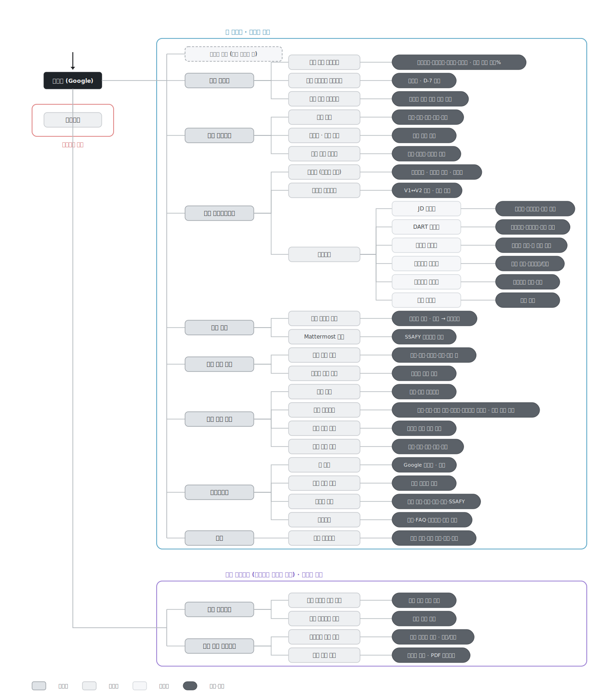
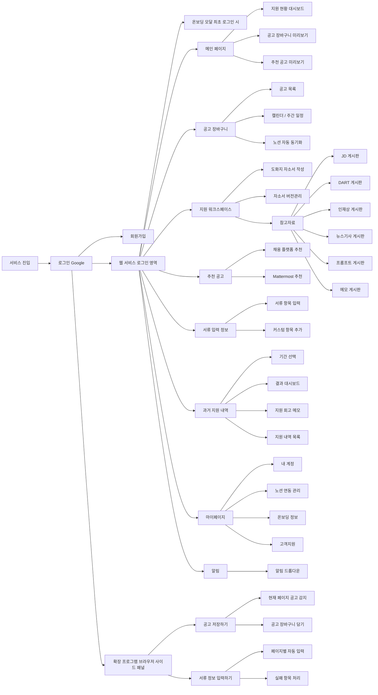

# 08. Information Architecture

이 문서는 사용자가 제공한 전체 IA 이미지를 기준으로 EZ-ONE의 정보구조를 정리한 canonical 문서다. P1 구현 범위와 완료 기준은 `docs/04_requirements.md`와 `docs/23_traceability.md`를 우선한다. P2/IA-only 항목은 화면 구조에는 남기되 명시 승인 전 활성 구현하지 않는다.

## 기준 이미지

- 기준 원본: 사용자가 제공한 EZ-ONE 전체 IA 이미지 `MVP IA.svg`
- 범위: 웹 서비스 로그인 영역, 비로그인 영역, Chrome Extension 브라우저 사이드 패널
- 목적: 전체 제품 메뉴 구조와 하위 기능 설명을 한 문서에서 확인한다.



## 전체 IA 사이트맵



## IA 범위 표

| 대영역 | 중분류 | 하위 항목 | 기능 설명 | 범위 |
| --- | --- | --- | --- | --- |
| 비로그인 영역 | 로그인 Google | 회원가입 | Google 로그인으로 서비스 진입 및 회원가입을 처리한다. | P1 |
| 웹 서비스 로그인 영역 | 온보딩 모달 | 최초 로그인 시 | 최초 로그인 사용자가 희망 직무, 기업, 지역, 스킬, SSAFY 여부를 입력한다. | P1 |
| 웹 서비스 로그인 영역 | 메인 페이지 | 지원 현황 대시보드 | 지원완료, 마감임박, 진행중, 지원전, 유저 대비 상위%를 보여준다. | P1 |
| 웹 서비스 로그인 영역 | 메인 페이지 | 공고 장바구니 미리보기 | 마감순 공고를 보여주고 D-7 이내 공고를 강조한다. | P1 |
| 웹 서비스 로그인 영역 | 메인 페이지 | 추천 공고 미리보기 | 온보딩 기반 맞춤 추천 카드를 보여준다. | P1 |
| 웹 서비스 로그인 영역 | 공고 장바구니 | 공고 목록 | 회사, 직무, 상태, 마감, 링크를 기준으로 저장 공고를 관리한다. | P1 |
| 웹 서비스 로그인 영역 | 공고 장바구니 | 캘린더 / 주간 일정 | 마감 일정을 캘린더나 주간 일정으로 표시한다. | P2/IA |
| 웹 서비스 로그인 영역 | 공고 장바구니 | 노션 자동 동기화 | 저장 공고와 자소서/도화지 연동 구조를 둔다. P1은 `JOB_ONLY`만 구현한다. | P1 보조 |
| 웹 서비스 로그인 영역 | 지원 워크스페이스 | 도화지 자소서 작성 | 문항별 자소서를 마크다운으로 작성하고 글자 수를 확인한다. | P1 |
| 웹 서비스 로그인 영역 | 지원 워크스페이스 | 자소서 버전관리 | V1, V2 비교와 변경 이력을 관리한다. | P1 |
| 웹 서비스 로그인 영역 | 지원 워크스페이스 | 참고자료 | 공고별 참고자료 게시판을 관리한다. | P1 |
| 웹 서비스 로그인 영역 | 참고자료 | JD 게시판 | 이미지, 마크다운, 항목을 정리한다. | P1 |
| 웹 서비스 로그인 영역 | 참고자료 | DART 게시판 | 확인 경로와 자유 작성 정리 메모를 남긴다. | P1 |
| 웹 서비스 로그인 영역 | 참고자료 | 인재상 게시판 | 키워드 정리와 내 경험 매칭을 기록한다. | P1 |
| 웹 서비스 로그인 영역 | 참고자료 | 뉴스기사 게시판 | 링크 수집, 지원 동기, 포부를 정리한다. | P1 |
| 웹 서비스 로그인 영역 | 참고자료 | 프롬프트 게시판 | 프롬프트를 저장하고 복사한다. | P2/IA |
| 웹 서비스 로그인 영역 | 참고자료 | 메모 게시판 | 자유 메모를 남긴다. | P1 |
| 웹 서비스 로그인 영역 | 추천 공고 | 채용 플랫폼 추천 | 온보딩 기반 공고를 별표로 장바구니에 담는다. | P1 |
| 웹 서비스 로그인 영역 | 추천 공고 | Mattermost 추천 | SSAFY 교육생 대상 추천 후보를 노출한다. | P2/IA |
| 웹 서비스 로그인 영역 | 서류 입력 정보 | 서류 항목 입력 | 학력, 어학, 자격증, 수상, 경력 등 반복 입력 정보를 저장한다. | P1 |
| 웹 서비스 로그인 영역 | 서류 입력 정보 | 커스텀 항목 추가 | 기업별 특수 항목을 추가한다. | P1 |
| 웹 서비스 로그인 영역 | 과거 지원 내역 | 기간 선택 | 연도 또는 반기 기준으로 과거 지원 내역을 필터링한다. | P2/IA |
| 웹 서비스 로그인 영역 | 과거 지원 내역 | 결과 대시보드 | 서류, 필기, 면접, 합격, 미지원 기업 유형 그래프와 유저 대비 위치를 보여준다. | P2/IA |
| 웹 서비스 로그인 영역 | 과거 지원 내역 | 지원 회고 메모 | 기간별 결과를 직접 정리한다. | P2/IA |
| 웹 서비스 로그인 영역 | 과거 지원 내역 | 지원 내역 목록 | 회사, 직무, 상태, 마감, 링크를 과거 내역으로 보여준다. | P2/IA |
| 웹 서비스 로그인 영역 | 마이페이지 | 내 계정 | Google 로그인 정보와 탈퇴를 관리한다. | P1 보조 |
| 웹 서비스 로그인 영역 | 마이페이지 | 노션 연동 관리 | 자동 동기화 설정을 관리한다. | P1 보조 |
| 웹 서비스 로그인 영역 | 마이페이지 | 온보딩 정보 | 희망 직무, 기업, 지역, 스킬, SSAFY 여부를 조회하고 수정한다. | P1 |
| 웹 서비스 로그인 영역 | 마이페이지 | 고객지원 | 문의, FAQ, 이용약관, 제휴 제안을 제공한다. | P2/IA |
| 웹 서비스 로그인 영역 | 알림 | 알림 드롭다운 | 마감 임박, 상태 변경, 추천, 저장 알림을 보여준다. | P2/IA |
| 확장 프로그램 | 공고 저장하기 | 현재 페이지 공고 감지 | 채용 페이지의 공고 정보를 감지한다. | P1 |
| 확장 프로그램 | 공고 저장하기 | 공고 장바구니 담기 | 직무 다중 체크 선택 후 선택 직무를 장바구니에 담는다. | P1 |
| 확장 프로그램 | 서류 정보 입력하기 | 현재 페이지 입력 보조 | 현재 페이지 기준으로 기본/문서/커스텀 항목을 입력 보조하고 성공/실패를 표시한다. | P1 |
| 확장 프로그램 | 서류 정보 입력하기 | 실패 항목 처리 | 실패 항목과 복사 후보를 표시한다. 파일 다운로드와 사이트별 고도화는 P2다. | P1/P2 |

## P1 구현 경계

P1의 핵심 루프는 아래 흐름으로 제한한다.

```text
Google 로그인 -> 온보딩 -> 메인 -> 공고 저장 -> 장바구니 -> 워크스페이스 -> 자소서/참고자료/서류 입력 정보 -> Notion JOB_ONLY sync
```

P1에서 활성 구현하지 않는 항목:

- 캘린더 / 주간 일정
- Mattermost 추천
- 과거 지원 내역과 통계
- 고객지원
- 알림 드롭다운
- 프롬프트 게시판의 전체 추가, 수정, 삭제 관리
- 확장 프로그램 서류 자동 입력 보조 고도화
- 자소서/도화지 Notion 동기화

## 문서 연결

| 목적 | 기준 문서 |
| --- | --- |
| 전체 IA 원본 | 이 문서 |
| 사용자 흐름 | `docs/08_user-flow.md` |
| 프론트 라우트와 화면 기준 | `docs/09_screen-design.md` |
| P1/P2 요구사항 판단 | `docs/04_requirements.md` |
| P1 구현 추적 | `docs/23_traceability.md` |
