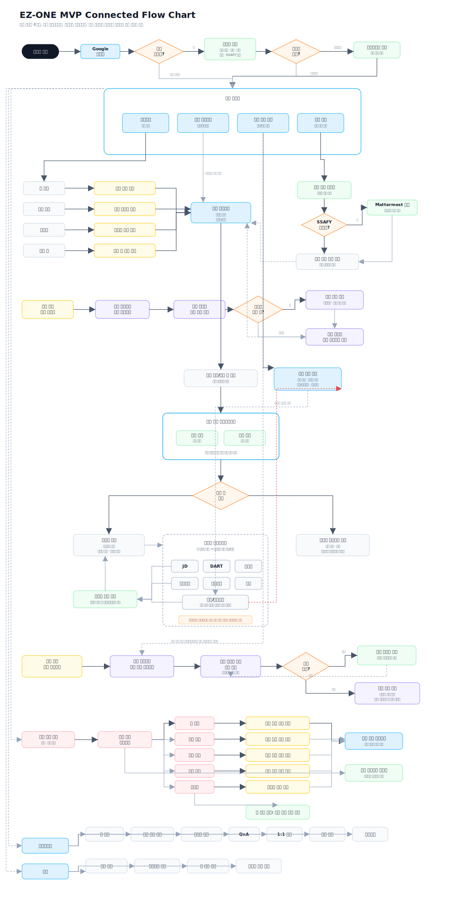
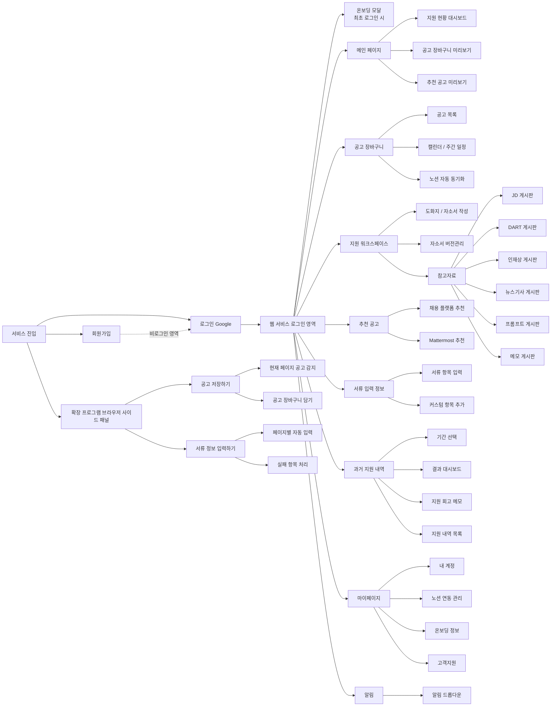
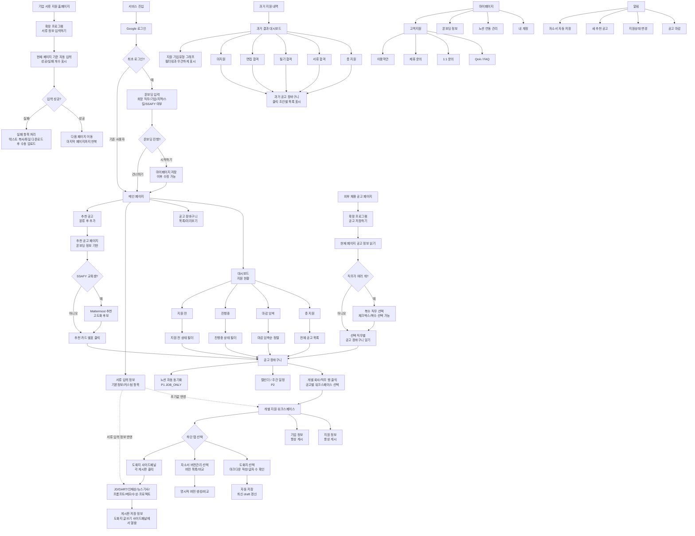
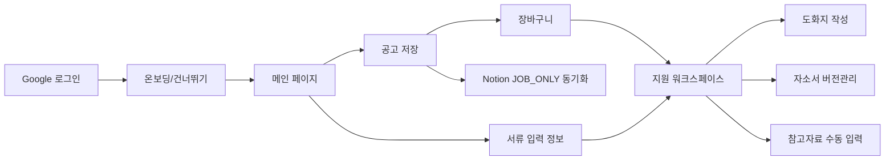

# 08. 사용자 흐름

기준 원본: Notion `08. User Flow`

상태: 완료. 이 문서는 전체 제품 흐름과 IA 연결을 설명한다. 전체 IA 원본은 `docs/08_information-architecture.md`를 기준으로 하며, P1 구현 범위와 완료 기준은 `docs/04_requirements.md`와 `docs/23_traceability.md`를 우선한다.

## 기준 이미지

## IA 사이트맵

아래 IA는 사용자가 제공한 정보구조 이미지를 기준으로 정리한 전체 제품 구조다. P2/IA-only 항목은 화면 구조에는 남기되 P1 완료 기준으로 구현하지 않는다.

## IA 범위 표

| IA 영역 | 하위 항목 | P1 여부 | 구현 기준 |
| --- | --- | --- | --- |
| 로그인 | Google 로그인, 최초 로그인 온보딩 | P1 | 사용자별 데이터 분리와 온보딩 저장 |
| 메인 페이지 | 지원 현황 대시보드, 장바구니 미리보기, 추천 공고 미리보기 | P1 | 각 카드/미리보기는 관련 목록으로 이동 |
| 공고 장바구니 | 공고 목록 | P1 | 회사, 직무, 지원상태, 마감일, 링크 표시 |
| 공고 장바구니 | 캘린더/주간 일정 | P2/IA | 마감 일정 표시. P1 완료 기준 제외 |
| 공고 장바구니 | 노션 자동 동기화 | P1 보조 | P1은 저장 공고 `JOB_ONLY` 동기화 |
| 지원 워크스페이스 | 도화지, 자소서 버전관리, 참고자료 | P1 | 상단 지원/기업 정보 유지, 하단 영역 전환 |
| 참고자료 | JD, DART, 인재상, 뉴스기사, 프롬프트, 메모 게시판 | P1 | 자동 수집 없이 수동 입력/열람 |
| 추천 공고 | 채용 플랫폼 추천 | P1 | 온보딩 기반 추천, 별표로 장바구니 저장 |
| 추천 공고 | Mattermost 추천 | P2/IA | SSAFY 추천 고도화 후보 |
| 서류 입력 정보 | 서류 항목 입력, 커스텀 항목 추가 | P1 | 표준 섹션과 커스텀 항목 CRUD |
| 과거 지원 내역 | 기간 선택, 결과 대시보드, 회고 메모, 지원 내역 목록 | P2/IA | MVP 이후 |
| 마이페이지 | 내 계정, 노션 연동 관리, 온보딩 정보 | P1 보조 | 계정 확인, 온보딩 수정, Notion 설정 |
| 마이페이지 | 고객지원 | P2/IA | 문의/FAQ/약관/제휴 등 |
| 알림 | 알림 드롭다운 | P2/IA | 마감, 상태 변경, 추천, 저장 알림 |
| 확장 프로그램 | 공고 저장하기 | P1 | 감지, 직무 선택, 장바구니 저장 |
| 확장 프로그램 | 서류 정보 입력하기 | P2/IA | 자동 입력과 실패 항목 처리 |

## 연결 흐름도

## P1 구현 경로

P1은 아래 흐름을 구현 기준으로 삼는다.

## 흐름 규칙

| 영역 | 규칙 |
| --- | --- |
| 로그인/온보딩 | 최초 로그인 사용자는 온보딩을 입력하거나 건너뛴다. 저장한 온보딩 정보는 마이페이지에서 수정한다. |
| 메인 페이지 | 대시보드, 장바구니, 서류 입력 정보, 추천 공고로 진입한다. |
| 대시보드 | 총 지원, 마감 임박, 진행중, 지원 전 카드는 장바구니 필터/정렬로 이동한다. |
| 공고 저장 | 확장 프로그램, 추천 공고, 직접 입력으로 저장한다. 저장 시 장바구니 row와 워크스페이스를 만든다. |
| 복수 직무 | 한 공고에 직무가 여러 개면 사용자가 저장할 직무를 선택한다. 선택 직무별로 장바구니에 저장한다. |
| 추천 공고 | P1은 Jasoseol.com 기반 추천과 star-to-basket을 구현한다. Mattermost 후보화는 P2다. |
| 워크스페이스 | 상단 지원/기업 정보는 유지하고 하단 탭에서 도화지, 자소서 버전관리, 참고자료를 전환한다. |
| 참고자료 | P1은 수동 입력과 사이드패널 열람이다. 자동 JD/news/DART/인재상 수집은 P2다. |
| 서류 입력 정보 | 기본 정보와 커스텀 항목을 저장하고, 워크스페이스 기본값으로 재사용한다. |
| Notion | P1은 공고 저장 시 `JOB_ONLY` 자동 동기화만 검증한다. |

## P2 / IA-only 흐름

아래 흐름은 전체 IA에는 포함하지만 P1 완료 기준이 아니다.

| 흐름 | 상태 |
| --- | --- |
| Mattermost 추천 | P2. SSAFY 추천 고도화 소스 |
| 서류 자동 입력 보조 | P2. 현재 페이지 기준 자동 입력, 실패 항목 처리 |
| 과거 지원 내역/통계 | P2. 기간별 결과, 과거 공고 장바구니, 기업유형 그래프 |
| 알림 | P2. 공고 마감, 상태 변경, 새 추천 공고, 자동 저장 알림 |
| 추천 hover 기업 정보 | P2. 기업 데이터 안정화 후 |
| 자소서/도화지 Notion 동기화 | P2. P1은 `JOB_ONLY` |
