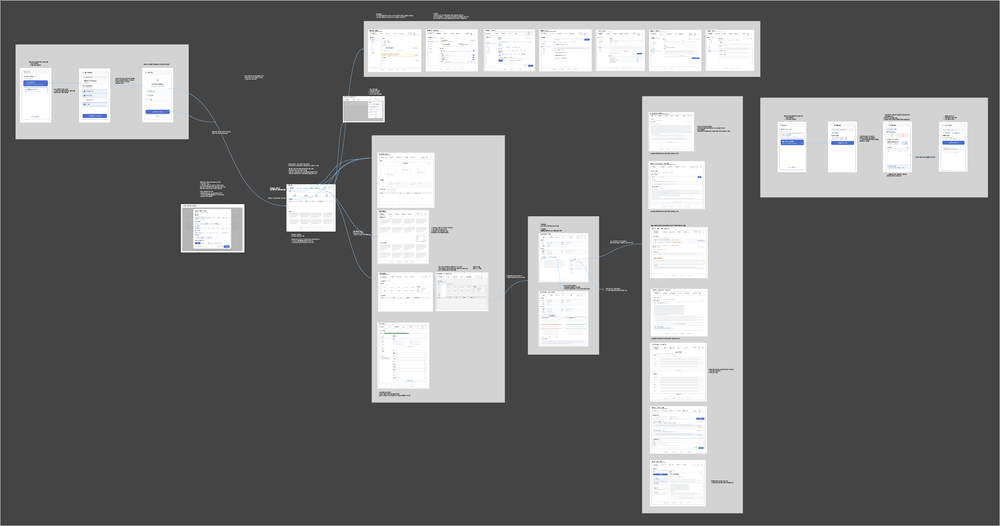
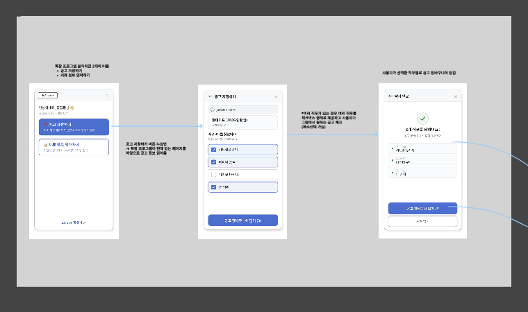
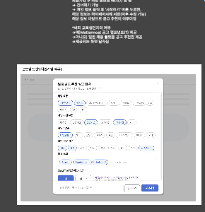
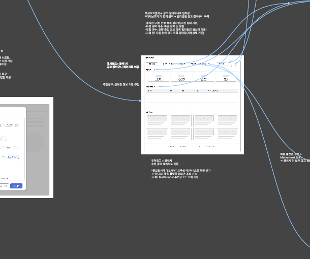
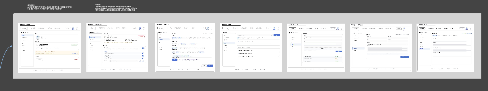
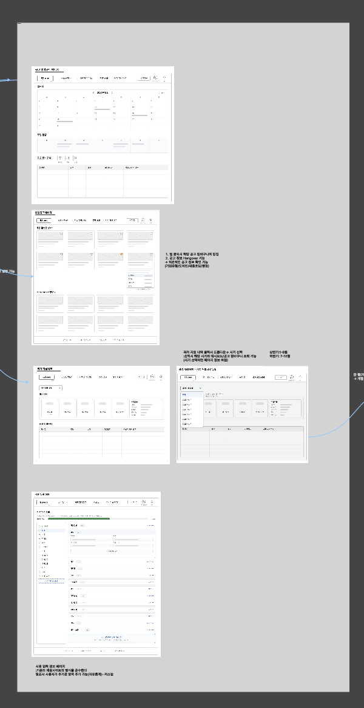
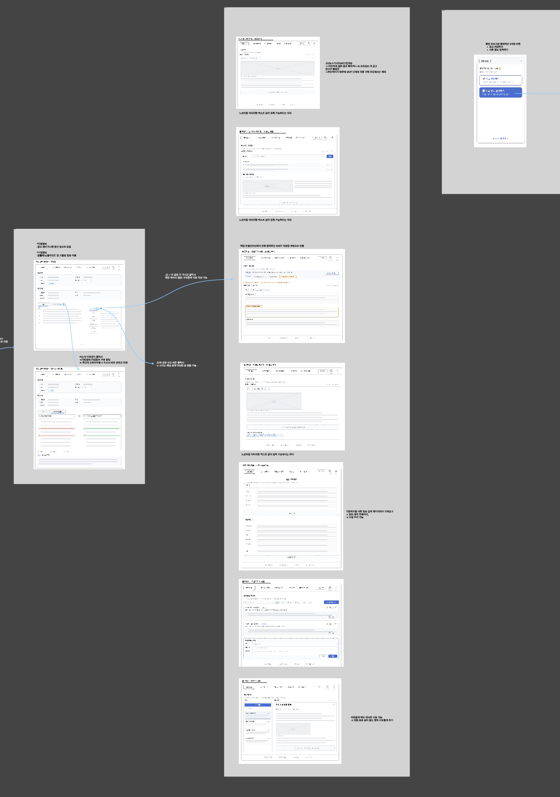
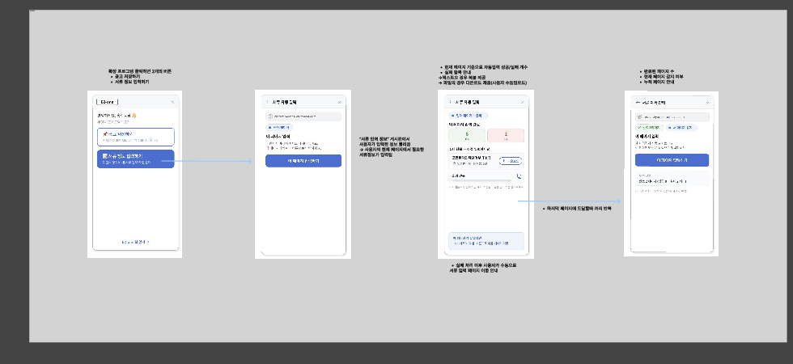
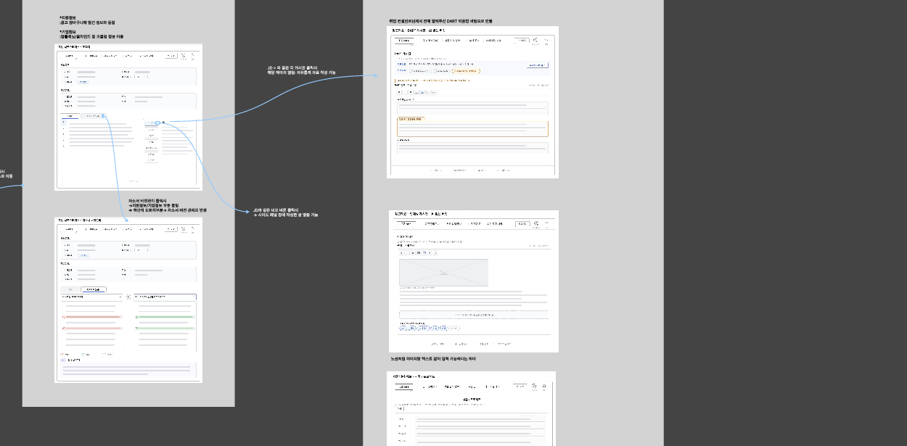

# 09. 화면설계서

기준 원본: Notion `09. 화면설계서`

이 문서는 프론트엔드 라우트, 페이지, 주요 컴포넌트, 상태, API 연결을 잡기 위한 화면 기준이다. P1 구현 범위는 `docs/04_requirements.md`, 요구사항 연결은 `docs/23_traceability.md`를 우선한다.

## 화면 기준

- 최종 와이어프레임 PDF: `docs/assets/wireframes/ez_one_wireframe_final.pdf`
- Figma: [EZ One](https://www.figma.com/design/gmDOGDBDih2eqBJ6LzZDL5/EZ-One?node-id=0-1&p=f&m=draw)
- P1 핵심 흐름: `공고 저장 -> 장바구니 -> 지원 워크스페이스 -> 참고자료/자소서 작성 -> 서류 입력 정보 재사용`
- 전체 IA 원본은 `docs/08_information-architecture.md`를 기준으로 한다.
- IA에는 P2 화면도 보일 수 있으나 P1 완료 기준으로 구현하지 않는다.

## 최종 와이어프레임



## IA 기준 Navigation Map

아래 구조는 사용자가 제공한 IA 이미지를 프론트 라우트와 구현 범위로 변환한 기준이다. 메뉴에는 전체 IA를 유지하되 P2 항목은 비활성, 예약, 또는 MVP 이후 안내로 처리한다.

| IA 대분류 | IA 중분류 | Route / Entry | Page / Component | P1 | 기준 |
| --- | --- | --- | --- | --- | --- |
| 비로그인 영역 | 로그인 Google | `/login` | `LoginPage` | Yes | Google OAuth 로그인 |
| 비로그인 영역 | 회원가입 | `/login` | `GoogleLoginButton` | Yes | 별도 회원가입 form 없이 Google 로그인으로 진입 |
| 웹 서비스 | 온보딩 모달 | `/onboarding` 또는 modal | `OnboardingPage`, `PreferenceForm` | Yes | 최초 로그인 시 표시, 마이페이지에서 수정 |
| 웹 서비스 | 메인 페이지 | `/` | `MainPage` | Yes | 대시보드/장바구니/추천/서류 입력 정보 진입 |
| 메인 페이지 | 지원 현황 대시보드 | `/` | `DashboardSummaryCards` | Yes | 지원완료, 마감임박, 진행중, 지원 전, 유저 대비 상위% |
| 메인 페이지 | 공고 장바구니 미리보기 | `/` | `BasketPreview` | Yes | 마감순, D-7 강조 |
| 메인 페이지 | 추천 공고 미리보기 | `/` | `RecommendationPreview` | Yes | 온보딩 기반 맞춤 추천 카드 |
| 공고 장바구니 | 공고 목록 | `/basket` | `BasketPage`, `BasketJobTable` | Yes | 회사, 직무, 상태, 마감, 링크 |
| 공고 장바구니 | 캘린더 / 주간 일정 | `/basket/calendar` 또는 basket section | `BasketCalendarPanel` | No | P2. 마감 일정 표시 |
| 공고 장바구니 | 노션 자동 동기화 | `/mypage/notion` 또는 save side effect | `NotionSettingsPage`, `SyncLogList` | Yes | P1은 공고 저장 `JOB_ONLY` |
| 지원 워크스페이스 | 도화지 | `/workspaces/:workspaceId?tab=canvas` | `CanvasTab` | Yes | 마크다운, 문항별 작성, 글자 수 |
| 지원 워크스페이스 | 자소서 버전관리 | `/workspaces/:workspaceId?tab=versions` | `VersionsTab` | Yes | V1/V2 비교, 변경 이력 |
| 지원 워크스페이스 | 참고자료 | `/workspaces/:workspaceId?tab=references` | `ReferencesTab`, `ReferenceSidePanel` | Yes | 게시판별 수동 입력/열람 |
| 참고자료 | JD 게시판 | workspace tab | `ReferenceBoardList`, type `JD` | Yes | 이미지/마크다운/항목 정리 |
| 참고자료 | DART 게시판 | workspace tab | `ReferenceBoardList`, type `DART` | Yes | 확인 경로/자유 작성 메모 |
| 참고자료 | 인재상 게시판 | workspace tab | `ReferenceBoardList`, type `PERSONA` | Yes | 키워드 정리/내 경험 매칭 |
| 참고자료 | 뉴스기사 게시판 | workspace tab | `ReferenceBoardList`, type `NEWS` | Yes | 링크 수집/지원동기/포부 |
| 참고자료 | 프롬프트 게시판 | workspace tab | `ReferenceBoardList`, type `PROMPT` | Yes | 프롬프트 저장/복사 |
| 참고자료 | 메모 게시판 | workspace tab | `ReferenceBoardList`, type `MEMO` | Yes | 자유 메모 |
| 추천 공고 | 채용 플랫폼 추천 | `/recommendations` | `RecommendationPage` | Yes | 온보딩 기반, 별표로 장바구니 저장 |
| 추천 공고 | Mattermost 추천 | `/recommendations?source=mattermost` | `MattermostRecommendationSection` | No | P2/IA. SSAFY 교육생만 노출 후보 |
| 서류 입력 정보 | 서류 항목 입력 | `/document-profile` | `DocumentProfilePage`, `ProfileSectionForm` | Yes | 학력, 어학, 자격증, 수상, 경력 등 |
| 서류 입력 정보 | 커스텀 항목 추가 | `/document-profile` | `CustomFieldEditor` | Yes | 기업별 특수 항목 |
| 과거 지원 내역 | 기간 선택 | `/history` | `PastHistoryPage` | No | P2. 연도/반기 드롭다운 |
| 과거 지원 내역 | 결과 대시보드 | `/history` | `PastResultDashboard` | No | P2. 합격/미지원/유저 대비 위치 |
| 과거 지원 내역 | 지원 회고 메모 | `/history` | `RetrospectiveMemo` | No | P2. 기간별 결과 직접 정리 |
| 과거 지원 내역 | 지원 내역 목록 | `/history` | `PastBasketTable` | No | P2. 조건별 목록 |
| 마이페이지 | 내 계정 | `/mypage/account` 또는 `/mypage` | `AccountSummary` | Partial | Google 로그인, 탈퇴 |
| 마이페이지 | 노션 연동 관리 | `/mypage/notion` | `NotionConnectionCard` | Yes | 자동 동기화 설정 |
| 마이페이지 | 온보딩 정보 | `/mypage/profile` 또는 `/mypage` | `ProfileEditForm` | Yes | 희망 직무/기업/지역/스킬/SSAFY |
| 마이페이지 | 고객지원 | `/mypage/support` | `SupportPage` | No | P2. 문의/FAQ/약관/제휴 |
| 알림 | 알림 드롭다운 | app header | `AlertDropdown` | No | P2. 마감/상태 변경/추천/저장 |
| 확장 프로그램 | 공고 저장하기 | Chrome popup | `JobSavePopup` | Yes | 현재 페이지 감지, 직무 다중 선택, 저장 |
| 확장 프로그램 | 서류 정보 입력하기 | Chrome side panel | `DocumentInputPanel` | No | P2. 자동 입력, 실패 항목 처리 |

## 와이어프레임 기준 프론트 구조

프론트엔드는 전체 와이어프레임 한 장만 보고 시작하지 않는다. 아래 분할 이미지 단위로 page shell, feature module, API client, store를 만든다.

| Wireframe | Frontend 진입점 | Page / Shell | Feature module | Store | API |
| --- | --- | --- | --- | --- | --- |
| `01_extension_job_save.png` | Chrome Extension popup | `extension/popup` | `extension/job-save` | extension local state | `/api/extension/jobs/extract`, `/api/extension/jobs/save` |
| `02_onboarding.png` | `/onboarding` | `OnboardingPage` | `features/auth`, `features/profile` | `authStore`, `profileStore` | `GET/PUT /api/me/profile` |
| `03_main_dashboard_recommendation.png` | `/` | `MainPage` | `features/dashboard`, `features/recommendations`, `features/basket` | `dashboardStore`, `recommendationStore`, `basketStore` | `GET /api/dashboard/summary`, `GET /api/recommendations/jobs` |
| `04_mypage_notion_alerts.png` | `/mypage`, `/mypage/notion` | `MyPage`, `NotionSettingsPage` | `features/profile`, `features/notion` | `profileStore`, `notionStore` | `/api/me`, `/api/me/profile`, `/api/integrations/notion/*` |
| `05_basket_workspace.png` | `/basket`, `/workspaces/:workspaceId` | `BasketPage`, `WorkspacePage` | `features/basket`, `features/workspace` | `basketStore`, `workspaceStore` | `GET /api/basket/jobs`, `GET /api/workspaces/{workspaceId}` |
| `06_reference_boards_side_panel.png` | workspace 하단 tab / side panel | `ReferencesTab`, `ReferenceSidePanel` | `features/references` | `workspaceStore` | `GET/POST /api/workspaces/{id}/references`, `GET /api/references/{id}` |
| `07_extension_document_input.png` | Chrome Extension input assist | `extension/document-input` | `extension/document-input` | extension local state | P2. P1 구현 제외 |
| `08_document_profile_auto_input.png` | `/document-profile` | `DocumentProfilePage` | `features/document-profile` | `profileStore` | `/api/document-profile/*` |

분할 와이어프레임:

| 01. Extension 공고 저장 | 02. Onboarding |
| --- | --- |
|  |  |

| 03. Main / Dashboard / Recommendation | 04. MyPage / Notion / Alerts |
| --- | --- |
|  |  |

| 05. Basket / Workspace | 06. Reference Boards / Side Panel |
| --- | --- |
|  |  |

| 07. Extension Document Input | 08. Document Profile / Auto Input |
| --- | --- |
|  |  |

## 와이어프레임별 구현 단위

### 01. Extension 공고 저장

```text
extension/src/
  popup/
    JobSavePopup.vue
    JobPreviewCard.vue
    JobRoleSelector.vue
    SaveResultPanel.vue
  shared/
    api/extensionJobApi.ts
    extractors/jasoseolExtractor.ts
```

완료 기준:
- 지원 사이트에서 공고 필드를 추출한다.
- 직무를 하나 이상 선택한 뒤 저장한다.
- 저장 성공 시 장바구니/워크스페이스 이동 경로를 표시한다.
- 추출 실패 시 잘못된 공고를 저장하지 않고 수동 보완 안내를 표시한다.

### 02. Onboarding

```text
frontend/src/pages/onboarding/
  OnboardingPage.vue
frontend/src/features/profile/
  components/PreferenceForm.vue
  components/SkillInput.vue
  components/RegionSelect.vue
  components/SsafyToggle.vue
```

완료 기준:
- 희망 직무, 기업 유형, 산업, 지역, 기술스택, SSAFY 여부를 저장한다.
- 최초 로그인 후 표시하고, 저장/건너뛰기 후 메인으로 이동한다.
- 마이페이지 수정 화면과 같은 form model을 재사용한다.

### 03. Main / Dashboard / Recommendation

```text
frontend/src/pages/main/
  MainPage.vue
frontend/src/features/dashboard/
  components/DashboardSummaryCards.vue
  components/BasketPreview.vue
frontend/src/features/recommendations/
  components/RecommendationPreview.vue
  components/RecommendationCard.vue
  components/StarSaveButton.vue
```

완료 기준:
- 지원 상태 카드는 `/basket?status=...` 또는 `/basket?sort=deadline`로 이동한다.
- 추천 공고 별표 클릭은 장바구니 저장과 workspace 생성으로 이어진다.
- 추천 empty/error/loading 상태를 각각 표시한다.

### 04. MyPage / Notion / Alerts

```text
frontend/src/pages/mypage/
  MyPage.vue
  NotionSettingsPage.vue
frontend/src/features/notion/
  components/NotionConnectionCard.vue
  components/SyncScopeSelector.vue
  components/SyncLogList.vue
```

완료 기준:
- 마이페이지에서 온보딩 정보를 수정한다.
- Notion 연결 상태와 최근 sync log를 표시한다.
- P1 동기화 scope는 `JOB_ONLY`만 활성화한다.
- 알림 화면은 IA/P2로 두고 P1 구현 기준에서 제외한다.

### 05. Basket / Workspace

```text
frontend/src/pages/basket/
  BasketPage.vue
  BasketDetailPanel.vue
frontend/src/pages/workspace/
  WorkspacePage.vue
frontend/src/features/basket/
  components/BasketFilterBar.vue
  components/BasketJobTable.vue
  components/ApplicationStatusBadge.vue
frontend/src/features/workspace/
  components/WorkspaceHeader.vue
  components/SupportInfoPanel.vue
  components/CompanyInfoPanel.vue
  components/WorkspaceTabs.vue
```

완료 기준:
- 장바구니는 전체, 진행중, 지원 전, 마감 임박 필터를 제공한다.
- 공고 row 클릭은 해당 workspace로 이동한다.
- workspace 상단 지원/기업 정보는 하단 탭 전환 중 유지된다.
- 없는 workspace는 404, 다른 사용자의 workspace는 403 상태로 처리한다.

### 06. Reference Boards / Side Panel

```text
frontend/src/features/references/
  components/ReferenceBoardList.vue
  components/ReferenceEditor.vue
  components/ReferenceDetailPage.vue
  components/ReferenceSidePanel.vue
  components/ReferenceTypeTabs.vue
```

완료 기준:
- 자유 메모, 커스텀 보드, JD, 뉴스, DART, 인재상 수동 입력을 제공한다.
- 참고자료는 전체 페이지와 작성 중 사이드 패널에서 모두 열 수 있다.
- P1에서는 자동 수집 버튼을 제공하지 않는다.

### 07. Extension Document Input

P2 화면이다. P1에서는 공고 저장 extension과 분리하고 구현하지 않는다.

예약 기준:
- 서류 입력 정보 기반 자동 입력 보조
- 실패 항목 복사 또는 파일 다운로드
- 사이트별 selector 변경 대응

### 08. Document Profile / Auto Input

```text
frontend/src/pages/document-profile/
  DocumentProfilePage.vue
frontend/src/features/document-profile/
  components/ProfileSectionTabs.vue
  components/ProfileSectionForm.vue
  components/CustomFieldList.vue
  components/CustomFieldEditor.vue
```

완료 기준:
- 기본정보, 학력, 경력, 프로젝트, 자격/어학, 수상/활동, 커스텀 항목을 저장한다.
- 섹션 단위 저장과 커스텀 항목 CRUD를 제공한다.
- workspace 기본값과 extension 입력 보조가 같은 data model을 사용한다.

## Frontend Route Map

| Route | Page | P1 | Entry | Primary API |
| --- | --- | --- | --- | --- |
| `/login` | LoginPage | Yes | 비로그인 진입 | `POST /api/auth/google` |
| `/onboarding` | OnboardingPage 또는 modal | Yes | 최초 로그인 | `GET/PUT /api/me/profile` |
| `/` | MainPage | Yes | 로그인 후 기본 | `GET /api/dashboard/summary`, `GET /api/recommendations/jobs` |
| `/basket` | BasketPage | Yes | 대시보드 카드, nav | `GET /api/basket/jobs` |
| `/basket/:basketJobId` | BasketDetailPage 또는 side detail | Yes | 장바구니 row | `GET /api/basket/jobs/{basketJobId}` |
| `/workspaces/:workspaceId` | WorkspacePage | Yes | 장바구니 row, 저장 완료 | `GET /api/workspaces/{workspaceId}` |
| `/document-profile` | DocumentProfilePage | Yes | 메인 카드, nav | `GET /api/document-profile` |
| `/recommendations` | RecommendationPage | Yes | 메인 추천 영역 | `GET /api/recommendations/jobs` |
| `/mypage` | MyPage | Partial | nav | `GET /api/me`, `GET /api/me/profile` |
| `/mypage/notion` | NotionSettingsPage | Yes | 마이페이지 | `/api/integrations/notion/*` |
| `/mypage/support` | SupportPage | No | IA only | P2 |
| `/history` | PastHistoryPage | No | IA only | P2 |
| `/alerts` | AlertsPage 또는 dropdown | No | IA only | P2 |
| `/basket/calendar` | BasketCalendarPage 또는 panel | No | IA only | P2 |

## App Shell

| 영역 | 컴포넌트 | 기준 |
| --- | --- | --- |
| AppShell | `AppLayout` | 로그인 이후 공통 layout. 상단 nav와 사용자 메뉴를 가진다. |
| Header | `GlobalHeader` | 로고, 장바구니, 추천, 서류 입력 정보, 마이페이지 진입을 제공한다. |
| Auth Guard | `RequireAuth` | access token이 없으면 `/login`으로 보낸다. |
| Onboarding Guard | `RequireOnboardingCheck` | 최초 로그인 사용자는 온보딩으로 보낸다. 건너뛰기는 허용한다. |
| Toast | `ToastHost` | 저장 성공, 실패, 중복, 외부 연동 실패를 표시한다. |
| Loading/Error | `PageState` | 주요 페이지는 loading, empty, error 상태를 가진다. |

## Page Structure

### LoginPage

| 항목 | 기준 |
| --- | --- |
| 목적 | Google 로그인 시작 |
| 주요 컴포넌트 | `GoogleLoginButton`, `AuthErrorMessage` |
| 성공 흐름 | 최초 사용자는 `/onboarding`, 기존 사용자는 `/` |
| 실패 상태 | OAuth 취소/실패 메시지 표시 |

### OnboardingPage

| 항목 | 기준 |
| --- | --- |
| 목적 | 추천 기준과 SSAFY 여부 저장 |
| 입력 | 희망 직무, 기업 유형, 산업, 지역, 기술스택, SSAFY 여부 |
| 주요 컴포넌트 | `OnboardingForm`, `SkillInput`, `RegionSelect`, `SsafyToggle` |
| 액션 | 저장 후 `/`, 건너뛰기 후 `/` |
| 재수정 | 마이페이지에서 같은 profile form을 재사용한다. |

### MainPage

| 항목 | 기준 |
| --- | --- |
| 목적 | 지원 현황과 주요 진입점 제공 |
| 주요 컴포넌트 | `DashboardSummaryCards`, `BasketPreview`, `DocumentProfileCard`, `RecommendationPreview` |
| 카드 이동 | 총 지원/진행중/지원 전은 `/basket?status=...`, 마감 임박은 `/basket?sort=deadline` |
| 빈 상태 | 저장 공고가 없으면 공고 저장 또는 추천 공고 확인 CTA를 표시한다. |

### BasketPage

| 항목 | 기준 |
| --- | --- |
| 목적 | 저장 공고 목록과 지원 상태 관리 |
| 주요 컴포넌트 | `BasketFilterBar`, `BasketJobTable`, `ApplicationStatusBadge`, `DeadlineBadge` |
| 필터 | 전체, 진행중, 지원 전, 마감 임박 |
| row 클릭 | 해당 공고의 `/workspaces/:workspaceId`로 이동 |
| 중복 저장 | 새 row를 만들지 않고 기존 row/워크스페이스 경로를 안내한다. |

### RecommendationPage

| 항목 | 기준 |
| --- | --- |
| 목적 | 온보딩 기반 추천 공고 확인과 저장 |
| 주요 컴포넌트 | `RecommendationCardList`, `RecommendationCard`, `StarSaveButton` |
| 저장 | 별표 클릭 시 장바구니에 저장하고 workspace 경로를 받는다. |
| SSAFY 분기 | Mattermost 후보 영역은 IA/P2로 표시 가능하나 P1 저장 기준은 Jasoseol.com 추천이다. |

### WorkspacePage

| 항목 | 기준 |
| --- | --- |
| 목적 | 공고별 작성 공간 |
| 상단 고정 | `WorkspaceHeader`, `SupportInfoPanel`, `CompanyInfoPanel` |
| 하단 탭 | `CanvasTab`, `VersionsTab`, `ReferencesTab` |
| 기본값 | 서류 입력 정보가 있으면 workspace defaults로 반영하고 없으면 빈 값으로 둔다. |
| 자동 저장 | dirty 표시, 저장 중, 저장 완료, 실패 상태를 표시한다. |
| 권한 오류 | 403은 접근 불가 화면, 404는 존재하지 않는 워크스페이스 화면을 표시한다. |

### CanvasTab

| 항목 | 기준 |
| --- | --- |
| 목적 | 자소서 문항별 초안 작성 |
| 주요 컴포넌트 | `QuestionList`, `DraftEditor`, `CharacterCounter`, `AutoSaveIndicator`, `ReferenceSidePanel` |
| 입력 | 텍스트, 이미지 payload |
| 저장 | 최신 draft row 갱신. 자동으로 version을 만들지 않는다. |

### VersionsTab

| 항목 | 기준 |
| --- | --- |
| 목적 | 명시적 자소서 버전 생성/비교 |
| 주요 컴포넌트 | `VersionList`, `CreateVersionButton`, `VersionComparePanel` |
| 기준 | 비교는 한 번에 두 버전만 허용한다. |

### ReferencesTab

| 항목 | 기준 |
| --- | --- |
| 목적 | 참고자료 수동 입력과 열람 |
| 게시판 | 자유 메모, 커스텀 보드, JD, 뉴스, DART, 인재상 |
| 주요 컴포넌트 | `ReferenceBoardList`, `ReferenceEditor`, `ReferenceDetailPage`, `ReferenceSidePanel` |
| P1 제외 | 자동 JD/news/DART/인재상 수집 |

### DocumentProfilePage

| 항목 | 기준 |
| --- | --- |
| 목적 | 지원서 입력 정보 저장과 재사용 |
| 섹션 | 기본정보, 학력, 경력, 프로젝트, 자격/어학, 수상/활동, 커스텀 항목 |
| 주요 컴포넌트 | `ProfileSectionTabs`, `ProfileSectionForm`, `CustomFieldList`, `CustomFieldEditor` |
| 저장 | 섹션 단위 저장. 커스텀 항목은 CRUD 제공 |

### MyPage / NotionSettingsPage

| 항목 | 기준 |
| --- | --- |
| 목적 | 계정, 온보딩 정보, Notion 연결 관리 |
| 주요 컴포넌트 | `AccountSummary`, `ProfileEditForm`, `NotionConnectionCard`, `SyncScopeSelector`, `SyncLogList` |
| P1 sync | `JOB_ONLY`만 완료 기준 |
| P2 sync | 자소서/도화지 동기화 scope는 비활성 또는 예약 표시 |

## Pinia Store 기준

| Store | 책임 |
| --- | --- |
| `authStore` | 로그인 상태, token refresh, logout |
| `profileStore` | 사용자/온보딩/서류 입력 정보 |
| `dashboardStore` | 대시보드 summary |
| `basketStore` | 장바구니 목록, 필터, 상태 변경 |
| `workspaceStore` | workspace detail, draft, versions, references |
| `recommendationStore` | 추천 목록, 추천 저장 |
| `notionStore` | Notion 연결 상태, sync setting, sync logs |
| `uiStore` | toast, loading overlay, modal 상태 |

## P1 / P2 화면 경계

| 화면/기능 | 상태 |
| --- | --- |
| 로그인, 온보딩, 메인, 장바구니, 워크스페이스, 서류 입력 정보, 추천 저장, Notion JOB_ONLY | P1 |
| 마이페이지 내 온보딩 수정, Notion 계정 확인 | P1 보조 |
| Mattermost 추천 후보, 과거 지원 내역, 알림, 추천 hover 기업 정보 | P2/IA only |
| 확장 프로그램 서류 자동 입력 보조 | P2. 공고 저장 extension과 분리 |

## UI 상태 기준

| 상태 | 표시 기준 |
| --- | --- |
| Loading | API 요청 중 skeleton 또는 spinner |
| Empty | 저장 공고/추천/참고자료가 없을 때 다음 행동 CTA 제공 |
| Error | 공통 오류 메시지와 재시도 버튼 |
| Unauthorized | 로그인 페이지로 이동 |
| Forbidden | 접근 권한 없음 화면 |
| External failure | 핵심 저장 성공 여부와 분리해 toast/log로 표시 |
| Auto-save | dirty, saving, saved, failed 상태를 구분 |

## Extension 화면

| 화면 | P1 | 기준 |
| --- | --- | --- |
| 공고 저장 popup | Yes | 현재 페이지 공고 감지, 직무 복수 선택, 미리보기, 저장 |
| 저장 완료 | Yes | 장바구니/워크스페이스 이동 링크 제공 |
| 추출 실패 | Yes | 실패 안내와 수동 입력 대안 제공 |
| 서류 자동 입력 | No | P2. 실패 항목 복사/파일 다운로드 흐름은 IA만 유지 |

## 화면 동작 원칙

- 공고 저장은 직무 단위로 장바구니에 저장한다.
- 공고 저장 성공 시 장바구니 row와 워크스페이스가 존재해야 한다.
- 장바구니 row 클릭은 워크스페이스 진입으로 이어진다.
- 워크스페이스 상단 지원/기업 정보는 하단 탭 전환 중 유지한다.
- 참고자료는 전체 페이지와 작성 중 사이드 패널에서 모두 열람 가능해야 한다.
- P2 기능은 화면에 보이더라도 비활성, 예약, 또는 MVP 이후 안내로 처리한다.

## Frontend 착수 기준

프론트엔드 개발은 아래 구조부터 시작한다.

```text
frontend/src/
  app/
    router/
    stores/
    layouts/
  pages/
    login/
    onboarding/
    main/
    basket/
    workspace/
    document-profile/
    recommendations/
    mypage/
  features/
    auth/
    dashboard/
    basket/
    workspace/
    references/
    document-profile/
    recommendations/
    notion/
  shared/
    api/
    components/
    constants/
    types/
```

완료 기준:

- 위 route map 기준으로 P1 page shell을 만들 수 있다.
- 각 page는 필요한 API와 store 책임을 알 수 있다.
- P2 화면이 P1 구현 범위처럼 보이지 않는다.
- 와이어프레임 캡처와 route/component 기준이 충돌하지 않는다.
