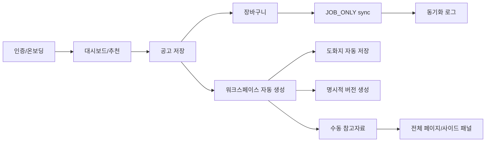

# 10. 기능 명세서

Source of truth: Notion `10. 기능 명세서`

이 문서는 P1 기능의 입력, 처리, 출력, 실패 처리를 정의한다. 화면 설명은 `docs/09_screen-design.md`, API 계약은 `docs/13_api-spec.md`를 우선한다.

## P1 기능 흐름

## 인증 / 온보딩

| 기능 | 입력 | 처리 | 출력 | 실패 처리 |
| --- | --- | --- | --- | --- |
| Google 로그인 | OAuth 인증 결과 | 사용자 조회/생성 후 JWT 발급 | access token, refresh token | OAuth 만료/거부 시 공통 오류 |
| 온보딩 저장 | 희망 직무, 기업 유형, 산업, 지역, 기술스택, SSAFY 여부 | 사용자 프로필 저장 | 저장된 프로필 | 형식 오류 반환 |
| 온보딩 건너뛰기 | 없음 | 빈 editable profile 상태 유지 | 기본 프로필 | 없음 |

## 대시보드 / 장바구니 / 추천

| 기능 | 입력 | 처리 | 출력 | 실패 처리 |
| --- | --- | --- | --- | --- |
| 대시보드 요약 | userId | 상태 수, 마감 임박 공고 집계 | 요약 카드 데이터 | 인증 필요 |
| 대시보드 카드 이동 | 카드 타입 | 장바구니 filter/sort query 생성 | 장바구니 URL | 타입이 없으면 기본 목록 |
| 공고 저장 | URL, 회사, 직무, 마감일, source | URL 중복 확인 후 job/basket/workspace 생성 | basketJobId, workspaceId | 중복이면 기존 경로 반환 |
| 추천 공고 저장 | recommendationId | 추천 공고를 장바구니에 저장 | basketJobId, workspaceId | 중복이면 기존 경로 반환 |

## 서류 입력 정보

| 기능 | 입력 | 처리 | 출력 | 실패 처리 |
| --- | --- | --- | --- | --- |
| 표준 섹션 저장 | sectionType, payload | 사용자별 섹션 저장 | section payload | 필드 검증 오류 |
| 커스텀 항목 저장 | label, fieldType, value | 사용자 정의 항목 생성/수정 | custom field | 빈 label 거부 |
| 워크스페이스 기본값 | workspaceId | 사용자 서류 입력 정보 조회 | 기본값 payload | 없는 값은 blank |

## 워크스페이스

| 기능 | 입력 | 처리 | 출력 | 실패 처리 |
| --- | --- | --- | --- | --- |
| 워크스페이스 열기 | workspaceId | ownership 검증 후 공고/회사/초안/참고자료 조회 | workspace detail | 403, 404 |
| 초안 저장 | questionId, body, imagePayload | debounce/forced save로 최신 draft 갱신 | saved state | 실패 시 local dirty 유지 |
| 버전 생성 | questionId, draft content | 명시적 version row 생성 | versionId | 빈 내용 거부 |
| 버전 비교 | versionId 2개 | 두 버전 diff 생성 | comparison result | 2개 미선택 시 거부 |

## 참고자료

| 기능 | 입력 | 처리 | 출력 | 실패 처리 |
| --- | --- | --- | --- | --- |
| 참고자료 생성 | boardName, referenceType, title, body/image/url | 수동 참고자료 저장 | reference item | 필수값 누락 거부 |
| 전체 페이지 열기 | referenceId | ownership 검증 후 전체 내용 조회 | full payload | 403, 404 |
| 사이드 패널 열기 | referenceId | ownership 검증 후 패널 내용 조회 | panel payload | 403, 404 |
| 커스텀 보드 | boardName | 사용자 정의 게시판 생성/분류 | board | 빈 이름 거부 |

## Notion

| 기능 | 입력 | 처리 | 출력 | 실패 처리 |
| --- | --- | --- | --- | --- |
| Notion 연결 | OAuth 결과 | 연결 계정과 workspace 저장 | connection status | OAuth 만료/거부 |
| 동기화 설정 저장 | syncEnabled, syncScope | P1은 `JOB_ONLY`만 저장 | sync setting | invalid scope 거부 |
| 공고 자동 동기화 | basket job event | 저장 공고만 Notion에 동기화 | sync log | 실패 로그 기록, core save 유지 |

## Chrome Extension

| 기능 | 입력 | 처리 | 출력 | 실패 처리 |
| --- | --- | --- | --- | --- |
| 공고 미리보기 | 현재 페이지 추출값 | 필수 필드 검증 | preview payload | 추출 실패 메시지 |
| 추출 공고 저장 | preview payload | 장바구니 저장 API 호출 | basket/workspace route | 중복/추출 실패 처리 |

## P2 / IA-only 기능

아래 기능은 IA에는 유지하지만 P1 기능 명세와 완료 기준에서 제외한다.

| 기능 | 상태 | 기준 |
| --- | --- | --- |
| 확장 프로그램 서류 입력 정보 조회 | P2 | 서류 자동 입력 보조 구현 시 API와 권한 정책을 확정한다. |
| 확장 프로그램 서류 자동 입력 | P2 | 현재 페이지 기준 자동 입력, 성공/실패 개수, 실패 항목 복사/다운로드 |
| 장바구니 캘린더/주간 일정 | P2 | P1 장바구니 목록/정렬 이후 마감 일정 표시로 검토 |
| 고객지원 | P2 | QnA, FAQ, 1:1 문의, 제휴 문의, 이용약관 운영 범위 확정 후 구현 |
