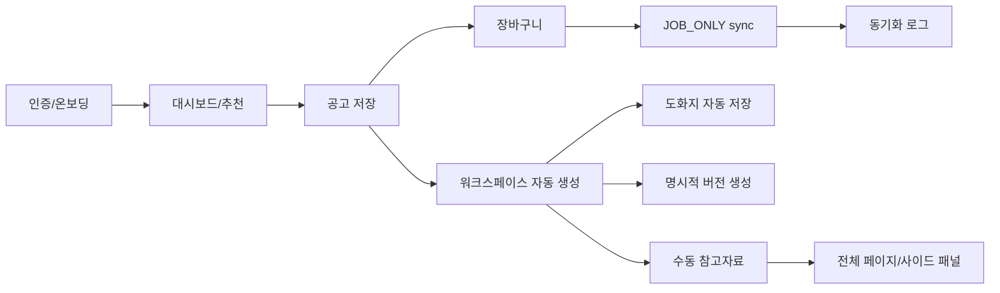

# 10. 기능 명세서

기준 원본: Notion `10. 기능 명세서`

이 문서는 P1 기능의 입력, 처리, 출력, 실패 처리를 정의한다. 화면 설명은 `docs/09_screen-design.md`, API 계약은 `docs/13_api-spec.md`를 우선한다.

## P1 기능 흐름

```mermaid
flowchart LR
    Auth[인증/온보딩] --> Discovery[대시보드/추천]
    Discovery --> Save[공고 저장]
    Save --> Basket[장바구니]
    Save --> Workspace[워크스페이스 자동 생성]
    Workspace --> Draft[도화지 자동 저장]
    Workspace --> Version[명시적 버전 생성]
    Workspace --> Reference[수동 참고자료]
    Reference --> SidePanel[전체 페이지/사이드 패널]
    Basket --> Notion[JOB_ONLY sync]
    Notion --> SyncLog[동기화 로그]
```

## 인증 / 온보딩

| 기능 | 입력 | 처리 | 출력 | 실패 처리 |
| --- | --- | --- | --- | --- |
| Google 로그인 | OAuth 인증 결과 | 사용자 조회/생성 후 JWT 발급 | access token, refresh token | OAuth 만료/거부 시 공통 오류 |
| 온보딩 저장 | 희망 직무, 기업 유형, 산업, 지역, 기술스택, SSAFY 여부 | 사용자 프로필 저장 | 저장된 프로필 | 형식 오류 반환 |
| 온보딩 건너뛰기 | 없음 | 빈 editable profile 상태 유지 | 기본 프로필 | 없음 |

## 대시보드 / 장바구니 / 추천

| 기능 | 입력 | 처리 | 출력 | 실패 처리 |
| --- | --- | --- | --- | --- |
| 대시보드 요약 | userId | 상태 수, 마감 임박 공고 집계 | 요약 카드 데이터 | 인증 필요 |
| 대시보드 카드 이동 | 카드 타입 | 장바구니 filter/sort query 생성 | 장바구니 URL | 타입이 없으면 기본 목록 |
| 공고 저장 | URL, 회사, 직무, 마감일, source | URL 중복 확인 후 job/basket/workspace 생성 | basketJobId, workspaceId | 중복이면 기존 경로 반환 |
| 추천 공고 저장 | recommendationId | 추천 공고를 장바구니에 저장 | basketJobId, workspaceId | 중복이면 기존 경로 반환 |

## 서류 입력 정보

| 기능 | 입력 | 처리 | 출력 | 실패 처리 |
| --- | --- | --- | --- | --- |
| 표준 섹션 저장 | sectionType, payload | 사용자별 섹션 저장 | section payload | 필드 검증 오류 |
| 표준 서류 섹션 저장 | sectionType, payload | 기본정보/학력/경력/프로젝트/자격/어학 등 표준 섹션 생성/수정 | document profile section | 사용자 계정 단위 저장 |
| 워크스페이스 기본값 | workspaceId | 사용자 서류 입력 정보 조회 | 기본값 payload | 없는 값은 blank |

## 워크스페이스

| 기능 | 입력 | 처리 | 출력 | 실패 처리 |
| --- | --- | --- | --- | --- |
| 워크스페이스 열기 | workspaceId | ownership 검증 후 공고/회사/초안/참고자료 조회 | workspace detail | 403, 404 |
| 초안 저장 | questionId, body, imagePayload | debounce/forced save로 최신 draft 갱신 | saved state | 실패 시 local dirty 유지 |
| 버전 생성 | questionId, draft content | 명시적 version row 생성 | versionId | 빈 내용 거부 |
| 버전 비교 | versionId 2개 | 두 버전 diff 생성 | comparison result | 2개 미선택 시 거부 |

## 참고자료

| 기능 | 입력 | 처리 | 출력 | 실패 처리 |
| --- | --- | --- | --- | --- |
| 참고자료 생성 | boardName, referenceType, title, body/image/url | 수동 참고자료 저장 | reference item | 필수값 누락 거부 |
| 전체 페이지 열기 | referenceId | ownership 검증 후 전체 내용 조회 | full payload | 403, 404 |
| 사이드 패널 열기 | referenceId | ownership 검증 후 패널 내용 조회 | panel payload | 403, 404 |
| 커스텀 보드 | boardName | 사용자 정의 게시판 생성/분류 | board | 빈 이름 거부 |

## Notion

| 기능 | 입력 | 처리 | 출력 | 실패 처리 |
| --- | --- | --- | --- | --- |
| Notion 연결 | OAuth 결과 | 연결 계정과 workspace 저장 | connection status | OAuth 만료/거부 |
| 동기화 설정 저장 | syncEnabled, syncScope | P1은 `JOB_ONLY`만 저장 | sync setting | invalid scope 거부 |
| 공고 자동 동기화 | basket job event | 저장 공고만 Notion에 동기화 | sync log | 실패 로그 기록, core save 유지 |

## Chrome Extension

| 기능 | 입력 | 처리 | 출력 | 실패 처리 |
| --- | --- | --- | --- | --- |
| 공고 미리보기 | 현재 페이지 추출값 | 필수 필드 검증 | preview payload | 추출 실패 메시지 |
| 추출 공고 저장 | preview payload | 장바구니 저장 API 호출 | basket/workspace route | 중복/추출 실패 처리 |
| 확장 프로그램 서류 입력 정보 조회 | Bearer token | 현재 사용자 document profile 조회 | sections/lastSavedAt | 미로그인/권한 오류 안내 |
| 확장 프로그램 서류 자동 입력 | 현재 탭 입력칸, document profile | label/placeholder/name/id/주변 텍스트 매칭, 장문 자기소개서 제외 | 자동 입력/실패/복사 후보 결과 | 매칭 실패 항목 수동 검토 안내 |

## P2 / IA-only 기능

아래 기능은 IA에는 유지하지만 P1 기능 명세와 완료 기준에서 제외한다.

| 기능 | 상태 | 기준 |
| --- | --- | --- |
| 장바구니 캘린더/주간 일정 | P2 | P1 장바구니 목록/정렬 이후 마감 일정 표시로 검토 |
| 고객지원 | P2 | QnA, FAQ, 1:1 문의, 제휴 문의, 이용약관 운영 범위 확정 후 구현 |
| Mattermost 채용공고 수집 | P2 | webhook 원문 raw 저장, 채용공고 후보 파싱, 검토 승인 후 SSAFY 사용자에게만 추천 노출 |
## 2026-06-16 Past Application History

- The history feature reads user-owned application records from `application_history`, including imported CSV history and basket jobs whose status indicates real application progress or non-application.
- The default `/history` view loads all records. The period selector filters by `ALL`, `YYYY-H1`, or `YYYY-H2`.
- Summary metrics are calculated for the selected period before optional result-stage row filtering and display the standard status counts: 지원완료, 미지원, 진행 중, 지원 전.
- Imported failure outcomes such as 서류탈락, 필기/과제탈락, and 면접탈락 count as 지원완료 for the standard status summary because the user did submit those applications.
- Supported result stages are `DOCUMENT_FAILED`, `TEST_FAILED`, `INTERVIEW_FAILED`, `NOT_APPLIED`, and `IN_PROGRESS`.
- Company-type counts use the requirement labels 대기업, 공공기관, 중견기업, 중소기업, 스타트업, 기타기업 and are returned with the same selected-period scope as the summary.
- The table supports client-side search by company, position, result text, and source URL within the loaded period/result-stage set.
- The table provides explicit label filters for standard application status, result label, and company type. These filters are separate from free-text search.
- The table supports client-side sorting by default API order, deadline latest/earliest, company name, and status label.
- Clicking a company-type bar filters visible table rows by that type. The reset control clears client-side search, label filters, and custom sort.
- Clicking a row opens `/workspaces/{workspaceId}`. The row also exposes separate `열기` and `원본 공고` links so workspace navigation and external posting navigation are distinct.
- The basket page exposes a `과거 지원 내역` entry point to `/history`.
- Changing a normal basket job away from `READY` snapshots it into `application_history`. Deleting a basket job only removes it from the active list and does not create history by itself.
- AI commentary and anonymous percentile comparison are excluded from this implementation.

## 2026-06-19 DART GMS AI Analysis

Requirement: `REF-003`, `JOB-018`, `REF-008`, `AI-004`, `AI-006`.

| Feature | Input | Processing | Output | Failure handling |
| --- | --- | --- | --- | --- |
| DART disclosure lookup | workspaceId, workspace company | Verify ownership, resolve OpenDART corp code, fetch recent periodic disclosures | recommended report list | Missing key, empty match, or provider failure returns non-blocking empty/unavailable state |
| DART AI analysis | selected `rceptNo`, report name, company/job/question context | Check GMS key/credit status, fetch/focus report text around business/R&D/risk/finance signals, call GMS OpenAI-compatible `/responses` with structured JSON prompt | evidence cards, appeal points, suggested sentences, cautions, missing info | GMS unavailable blocks analysis only; workspace and manual memo remain usable |
| DART AI evaluation | structured AI result, selected `rceptNo` | Run deterministic quality gate for source grounding, policy safety, output normalization, and usefulness scoring | improved analysis result or failed analysis | Ungrounded or prohibited output is removed; no valid evidence means `FAILED` |
| Save DART reference | completed analysisId | Verify same user/workspace, format reviewed result, save via existing reference material flow | `DART` reference material | Failed/foreign analysis cannot be saved |

Prompt rules: use only report-provided facts, include source section and receipt number for core claims, prioritize essay evidence over generic company introduction, and exclude investment advice, stock outlooks, hiring probability, and unsupported claims. The AI result never auto-edits essay drafts.

Evaluation details and regression history are recorded in `docs/34_dart-ai-evaluation.md`.

## 2026-06-20 Company Snapshot Enrichment

Requirement: `DATA-002`, `DATA-004`, `JOB-016`, `WS-028`.

| Feature | Input | Processing | Output | Failure handling |
| --- | --- | --- | --- | --- |
| 금융위 기업기본정보 보강 | companyName | 기업명 exact match 후 기업구분, 업종, 대표자, 설립일, 직원 수, 홈페이지, 주소, 주요사업을 profile로 변환 | `company_profiles`, `company_profile_sources` | 키 없음, 빈 결과, 파싱 실패는 `Optional.empty`로 처리하고 저장을 막지 않음 |
| OpenDART 기업개황 보강 | companyName | `corpCode.xml`에서 가장 구체적인 양방향 이름 매칭 후 `company.json`을 조회해 누락 필드 보강 | corp code, stock code, 법인구분, 대표자, 주소, 홈페이지, 설립일 | OpenDART 실패는 저장 실패로 전파하지 않음 |
| 워크스페이스 기업정보 상태 | workspaceId | 공식 출처 수와 유효 필드 수로 확인 상태 계산 | `OFFICIAL`, `PARTIAL`, `UNVERIFIED` 및 출처명 | 미확인 상태에서도 워크스페이스는 정상 로드 |
