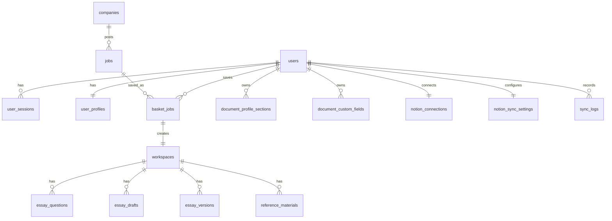

# 12. ERD

기준 원본: Notion `12. ERD`

이 문서는 P1 데이터 모델 기준이다. 실제 SQL 파일명과 세부 타입은 구현 중 확정하며, 변경 시 이 문서와 `docs/13_api-spec.md`를 함께 갱신한다. DB migration 도구는 현재 보류 상태다.

## 관계 다이어그램

## P1 테이블

| 테이블 | 주요 컬럼 | 비고 |
| --- | --- | --- |
| `users` | id, email, name, nickname, provider, provider_id, profile_completed, created_at | 서비스 로그인 계정 |
| `user_sessions` | id, user_id, refresh_token_hash, expires_at, revoked_at, created_at | refresh token hash 저장. 원문 token 저장 금지 |
| `user_profiles` | user_id, desired_roles, company_types, industries, regions, skills, is_ssafy | 온보딩/추천 기준 |
| `companies` | id, name, domain, company_type, size, rating, starting_salary | 기업 정보. P1은 nullable 허용 |
| `jobs` | id, company_id, title, role, deadline_at, source, url | 원본 공고 |
| `basket_jobs` | id, user_id, job_id, application_status, status_updated_at, status_reason, saved_source, deleted_at | 사용자가 저장한 공고 |
| `workspaces` | id, user_id, basket_job_id, created_at, updated_at | 공고 저장 시 자동 생성 |
| `essay_questions` | id, workspace_id, question_text, max_length, sort_order | 추출 또는 사용자 입력 문항 |
| `essay_drafts` | id, workspace_id, question_id, body, image_payload_json, save_revision, client_updated_at, auto_saved_at | 최신 자동 저장 초안 |
| `essay_versions` | id, workspace_id, question_id, version_name, body, image_payload_json, created_at | 사용자가 명시적으로 저장한 비교용 버전 |
| `document_profile_sections` | id, user_id, section_type, payload_json | 표준 서류 입력 정보 |
| `document_custom_fields` | id, user_id, label, field_type, value | 사용자 커스텀 항목 |
| `reference_materials` | id, workspace_id, board_name, reference_type, title, body, image_payload_json, url, display_mode | 수동 참고자료 |
| `notion_connections` | user_id, notion_account_email, workspace_id, access_token_ref, status | Notion 연결 계정 |
| `notion_sync_settings` | user_id, sync_enabled, sync_scope | P1 기본 scope는 `JOB_ONLY` |
| `sync_logs` | id, user_id, target, status, message, created_at | 외부 연동 로그 |

## P2 예약 테이블

| 테이블 | 주요 컬럼 | 비고 |
| --- | --- | --- |
| `company_info_sources` | id, company_id, source_name, source_url, collected_at, status, created_at, updated_at | P1은 저장 공고 URL을 `UNVERIFIED` 출처로 기록하고 자동 외부 수집은 수행하지 않음 |
| `mm_messages` | id, channel_id, message_id, raw_payload_json, received_at, parse_status | Mattermost raw-first 저장 |
| `mm_parsed_job_posts` | id, mm_message_id, company_name, title, url, deadline_at, review_status | 관리자 검토용 후보 공고 |

## Enum 기준

| Enum | 값 |
| --- | --- |
| `application_status` | `READY`, `IN_PROGRESS`, `COMPLETED`, `NOT_APPLIED` |
| `status_reason` | `USER_SET`, `WORK_STARTED`, `DEADLINE_PASSED` |
| `sync_scope` | `JOB_ONLY`, `JOB_WITH_ESSAY`, `JOB_WITH_ESSAY_AND_CANVAS` |
| `reference_type` | `FREE_MEMO`, `JD`, `NEWS`, `DART`, `TALENT_PROFILE`, `PROMPT`, `CUSTOM` |
| `reference_display_mode` | `FULL_PAGE`, `SIDE_PANEL`, `BOTH` |
| `source_status` | `NOT_COLLECTED`, `COLLECTED`, `FAILED`, `MANUAL` |

## 구현 주의사항

- 모든 사용자 소유 테이블은 API/service에서 ownership을 검증한다.
- 자동 저장은 최신 draft row를 갱신하고 version row를 자동 생성하지 않는다.
- 외부 연동 실패는 `sync_logs`에 기록하되 basket/workspace 저장을 롤백하지 않는다.
- 마감 경과 상태 변경은 scheduler 또는 dashboard/basket read guard 중 구현 방식 확정 후 문서에 반영한다.
