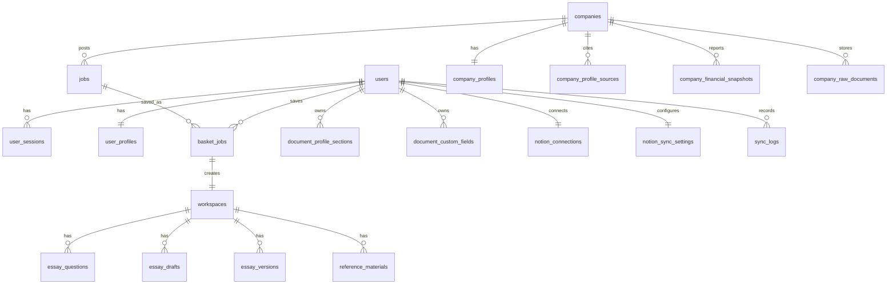

# 12. ERD

기준 원본: Notion `12. ERD`

이 문서는 P1 데이터 모델 기준이다. 실제 SQL 파일명과 세부 타입은 구현 중 확정하며, 변경 시 이 문서와 `docs/13_api-spec.md`를 함께 갱신한다. DB migration 도구는 현재 보류 상태다.

## 관계 다이어그램

```mermaid
erDiagram
    users ||--o{ user_sessions : has
    users ||--|| user_profiles : has
    users ||--o{ basket_jobs : saves
    users ||--o{ document_profile_sections : owns
    users ||--o{ document_custom_fields : owns
    users ||--|| notion_connections : connects
    users ||--|| notion_sync_settings : configures
    users ||--o{ sync_logs : records
    companies ||--o{ jobs : posts
    companies ||--|| company_profiles : has
    companies ||--o{ company_profile_sources : cites
    companies ||--o{ company_financial_snapshots : reports
    companies ||--o{ company_raw_documents : stores
    jobs ||--o{ basket_jobs : saved_as
    basket_jobs ||--|| workspaces : creates
    workspaces ||--o{ essay_questions : has
    workspaces ||--o{ essay_drafts : has
    workspaces ||--o{ essay_versions : has
    workspaces ||--o{ reference_materials : has
```

## P1 테이블

| 테이블 | 주요 컬럼 | 비고 |
| --- | --- | --- |
| `users` | id, email, name, nickname, provider, provider_id, profile_completed, created_at | 서비스 로그인 계정 |
| `user_sessions` | id, user_id, refresh_token_hash, expires_at, revoked_at, created_at | refresh token hash 저장. 원문 token 저장 금지 |
| `user_profiles` | user_id, desired_roles, company_types, industries, regions, skills, is_ssafy | 온보딩/추천 기준 |
| `companies` | id, name, domain, company_type, size, rating, starting_salary | 기업 정보. P1은 nullable 허용 |
| `company_profiles` | id, company_id, corp_code, stock_code, industry, ceo_name, founded_at, employee_count, homepage_url, address, profile_summary | 워크스페이스 표시용 기업 상세 정보 |
| `company_profile_sources` | id, company_id, source_type, source_name, source_url, license_note, collected_at | 기업 상세 정보 출처와 라이선스 메모 |
| `company_financial_snapshots` | id, company_id, fiscal_year, statement_type, revenue_amount, operating_income_amount, net_income_amount, total_assets_amount | DART/공공데이터 기반 연도별 재무 요약 |
| `company_raw_documents` | id, company_id, source_type, source_document_id, document_title, source_url, payload_json, payload_text | 원천 API 응답 또는 검수용 원문 저장 |
| `jobs` | id, company_id, title, role, deadline_at, source, url | 원본 공고 |
| `basket_jobs` | id, user_id, job_id, application_status, status_updated_at, status_reason, saved_source, deleted_at | 사용자가 저장한 공고 |
| `workspaces` | id, user_id, basket_job_id, created_at, updated_at | 공고 저장 시 자동 생성 |
| `essay_questions` | id, workspace_id, question_text, max_length, sort_order | 추출 또는 사용자 입력 문항 |
| `essay_drafts` | id, workspace_id, question_id, body, image_payload_json, save_revision, client_updated_at, auto_saved_at | 최신 자동 저장 초안 |
| `essay_versions` | id, workspace_id, question_id, version_name, body, image_payload_json, created_at | 사용자가 명시적으로 저장한 비교용 버전 |
| `document_profile_sections` | id, user_id, section_type, payload_json | 표준 서류 입력 정보 |
| `document_custom_fields` | id, user_id, label, field_type, value | 사용자 커스텀 항목 |
| `reference_materials` | id, workspace_id, board_name, reference_type, title, body, image_payload_json, url, display_mode | 수동 참고자료 |
| `notion_connections` | user_id, notion_account_email, workspace_id, access_token_ref, status | Notion 연결 계정 |
| `notion_sync_settings` | user_id, sync_enabled, sync_scope | P1 기본 scope는 `JOB_ONLY` |
| `sync_logs` | id, user_id, target, status, message, created_at | 외부 연동 로그 |

## P2 예약 테이블

| 테이블 | 주요 컬럼 | 비고 |
| --- | --- | --- |
| `company_info_sources` | id, company_id, source_name, source_url, collected_at, status, created_at, updated_at | P1은 저장 공고 URL을 `UNVERIFIED` 출처로 기록하고 자동 외부 수집은 수행하지 않음 |
| `mm_messages` | id, channel_id, message_id, raw_payload_json, posted_at, received_at, parse_status | Mattermost raw-first 저장 |
| `mm_parsed_job_posts` | id, mm_message_id, company_name, title, url, deadline_at, review_status | 관리자 검토용 후보 공고 |

## Mattermost P2 구현 추가

- `mm_messages`는 Mattermost webhook 원문을 raw-first로 저장한다. `message_id`는 중복 수신 방지를 위해 unique다. `posted_at`은 Mattermost 원본 게시 시각, `received_at`은 backend 수신 시각이다.
- `mm_parsed_job_posts`는 채용공고로 판단된 후보만 저장한다. `review_status = APPROVED`로 검토된 후보만 `jobs.source = 'MATTERMOST'` 공고로 승격한다.
- Mattermost 추천은 `user_profiles.is_ssafy = true` 사용자에게만 조회/저장 가능하다.

## Enum 기준

| Enum | 값 |
| --- | --- |
| `application_status` | `READY`, `IN_PROGRESS`, `COMPLETED`, `NOT_APPLIED` |
| `status_reason` | `USER_SET`, `WORK_STARTED`, `DEADLINE_PASSED` |
| `sync_scope` | `JOB_ONLY`, `JOB_WITH_ESSAY`, `JOB_WITH_ESSAY_AND_CANVAS` |
| `reference_type` | `FREE_MEMO`, `JD`, `NEWS`, `DART`, `TALENT_PROFILE`, `PROMPT`, `CUSTOM` |
| `reference_display_mode` | `FULL_PAGE`, `SIDE_PANEL`, `BOTH` |
| `source_status` | `NOT_COLLECTED`, `COLLECTED`, `FAILED`, `MANUAL` |

## 2026-06-19 DART GMS AI Analysis Data Note

- Requirement: `REF-003`, `JOB-018`, `REF-008`, `AI-004`, `AI-006`.
- Current implementation stores reviewed DART AI output in existing `reference_materials` with `reference_type = DART` and `board_name = DART`.
- OpenDART disclosure lookup and GMS analysis preview are non-blocking integration steps. The initial analysis preview cache is runtime-scoped and does not introduce a required migration.
- If async processing, durable cache, or cross-session retrieval becomes required, add `dart_analysis_jobs` with `workspace_id`, `company_id`, `rcept_no`, `status`, `model`, `result_json`, `error_message`, `created_at`, and `updated_at`, plus a unique key on `(workspace_id, rcept_no)`.
- Secrets remain outside the database and are read only from backend environment/configuration.

## 구현 주의사항

- 모든 사용자 소유 테이블은 API/service에서 ownership을 검증한다.
- 자동 저장은 최신 draft row를 갱신하고 version row를 자동 생성하지 않는다.
- 외부 연동 실패는 `sync_logs`에 기록하되 basket/workspace 저장을 롤백하지 않는다.
- 마감 경과 상태 변경은 scheduler 또는 dashboard/basket read guard 중 구현 방식 확정 후 문서에 반영한다.
## 2026-06-06 Company Logo Update

- `companies` now owns reusable company logo metadata: `logo_url`, `logo_source_url`, `logo_status`, `logo_updated_at`.
- Jobs continue to reference companies through `jobs.company_id`; saved jobs continue to reference jobs through `basket_jobs.job_id`.
- Company deduplication should prefer `name + domain` over company name alone. New schema and migration use `uk_companies_name_domain (name, domain)`.
- P1 overwrite policy: when a save request includes a valid optional `logoUrl`, the server stores it only if `companies.logo_url` is empty. Existing company logos are preserved.
- Basket and workspace API responses expose the company logo as `companyLogoUrl` and `companyDetails.logoUrl`; clients should fall back to an initials badge when the URL is missing or broken.
- `V9__seed_demo_jobs_and_recommendations.sql` temporarily seeds demo basket jobs and `jobs.source = 'RECOMMENDATION'` rows with company logos for local UI verification. These rows use `ez-one-demo-*` source URLs so they can be removed later.
## 2026-06-16 Application History Update

- Added `application_history` for past application rows from CSV import and basket jobs with meaningful application status.
- `application_history.workspace_id` is unique and links each history row to the existing workspace surface.
- Import-created `basket_jobs` use `saved_source = 'HISTORY_IMPORT'`; active basket queries exclude that source while workspace lookup remains available.
- Deleted basket jobs keep their `basket_jobs.deleted_at` value for active-list exclusion. Delete alone does not create history because the user may be removing a mistakenly saved posting.
- Active basket jobs are also eligible for history display when their status is `COMPLETED`, `IN_PROGRESS`, `NOT_APPLIED`, or past-deadline `READY`; status changes away from `READY` upsert a durable `application_history` snapshot.
- Key columns: `user_id`, `workspace_id`, `company_name`, `position_title`, `application_status`, `result_stage`, `raw_result`, `deadline_date`, `period_key`, `period_year`, `period_half`, `source_url`, `company_type`.
- Indexes: `idx_application_history_user_period (user_id, period_key)` and `idx_application_history_user_result (user_id, result_stage)`.

## 2026-06-18 Realtime Company Enrichment Update

- `companies.company_type`, `companies.size`, and placeholder/job-board `companies.domain` values may be updated after a saved job is linked to a company.
- `company_profiles.source_priority = REALTIME_OFFICIAL_API` means the row was populated by a realtime official-provider lookup during basket/history-linked save.
- `company_profile_sources.source_type` additionally supports `ALIO_PUBLIC_INSTITUTION`, `FTC_BUSINESS_GROUP`, and `MME_CONFIRMATION`.
- Realtime provider failures are not persisted as blocking errors and must not roll back `jobs`, `basket_jobs`, or `workspaces`.

## 2026-06-18 Official Company Classification Update

- `companies.company_type` and `companies.size` may be populated from an official classification registry before falling back to internal rules.
- `company_profiles.source_priority = OFFICIAL_CLASSIFICATION` means the company profile was populated from an official classification source rather than a saved job URL.
- `company_profile_sources.source_type` records the provenance:
  - `FTC_BUSINESS_GROUP` for 공정거래위원회 기업집단포털.
  - `ALIO_PUBLIC_INSTITUTION` for ALIO 공공기관 경영정보 공개시스템.
- Saved posting URLs remain in `company_info_sources` as `SAVED_JOB_URL/UNVERIFIED` and must not be used as official company-type evidence.

## 2026-06-20 Financial Commission/OpenDART Company Snapshot Update

## 2026-06-20 Mattermost Recommendation Scoring Update

- Requirement: `MM-001`, `MM-006`, `MM-007`, `MM-008`, `MM-009`, `REC-003`, `REC-004`.
- `mm_parsed_job_posts` now includes `deadline_label`, `deadline_type`, `deadline_date`, and `normalized_deadline_label`. The raw channel deadline remains available while normalized fields support stable filtering and sorting.
- `mm_recommendation_scores` stores per-user candidate scoring with `user_id`, `candidate_id`, `score`, `role_score`, `skills_score`, `profile_score`, `deadline_score`, `source_score`, `recommended`, `reason`, `evidence_json`, `model_version`, and `status`.
- Score status values are `PENDING`, `READY`, `FAILED`, and `RULE_FALLBACK`. The recommendation list can render immediately even when a durable AI score has not been produced yet.
- A unique key on `(user_id, candidate_id)` keeps stored scores user-scoped and prevents duplicate recommendation score rows.

## 2026-06-20 Financial Commission/OpenDART Company Snapshot Details

- `company_profiles`의 기존 컬럼을 재사용해 금융위원회 기업기본정보와 OpenDART 기업개황에서 확인된 `corp_code`, `stock_code`, `business_number`, `industry`, `company_category`, `ceo_name`, `founded_at`, `employee_count`, `homepage_url`, `address`, `profile_summary`, `source_priority`를 저장한다.
- 신규 migration 없이 `source_priority` 값으로 `FINANCIAL_COMMISSION_COMPANY_BASIC` 또는 `OPENDART_COMPANY_OVERVIEW`를 사용할 수 있다.
- `company_profile_sources.source_type`은 `FINANCIAL_COMMISSION_COMPANY_BASIC`, `OPENDART_COMPANY_OVERVIEW`를 추가로 기록한다.
- 저장 공고 URL은 계속 `company_info_sources`의 `SAVED_JOB_URL/UNVERIFIED` 컨텍스트로만 남기며, 채용 플랫폼 도메인은 기업 홈페이지 보강값으로 사용하지 않는다.
