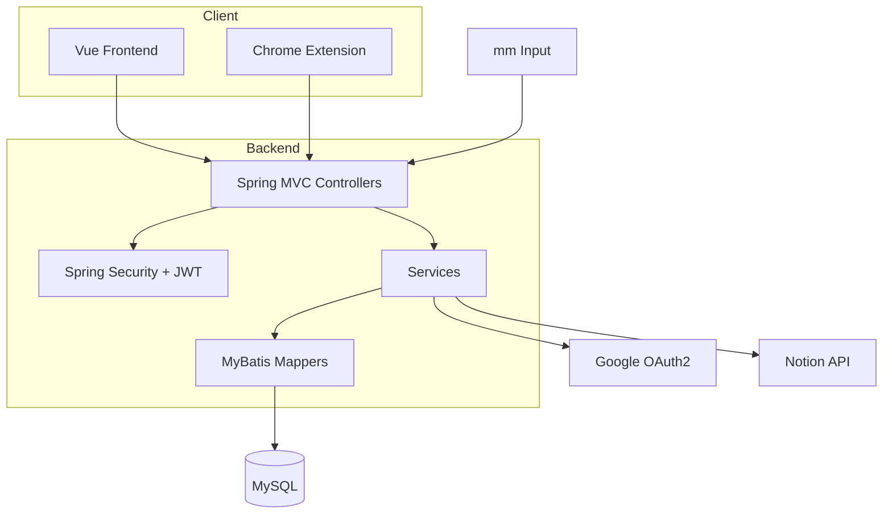

# 16. 시스템 아키텍처

기준 원본: Notion `16. 시스템 아키텍처`

## 목적

이 문서는 EZ One monorepo의 구현 책임과 데이터 흐름을 설명한다.

## 구성요소

| 구성요소 | 경로/기술 | 책임 |
| --- | --- | --- |
| Backend API | `backend/` | REST API, 인증/인가, 도메인 로직, DB, 외부 연동 |
| Frontend | `frontend/` | Vue 3 웹 앱, 화면 상태, API client |
| Chrome Extension | `extension/` | P1 공고 추출/미리보기/저장, 이후 서류 입력 보조 고도화 |
| Database | MySQL | 사용자, 세션, 공고, 장바구니, 워크스페이스, 서류 입력 정보, Notion 데이터 |
| External | Google OAuth2, Notion API, mm input | 로그인, job-only sync, P2 raw collection |

## 컴포넌트 다이어그램

## 계약 기준

| 계약 | 기준 문서 | 변경 규칙 |
| --- | --- | --- |
| Frontend -> Backend | `docs/13_api-spec.md` | endpoint, request, response, error contract를 먼저 갱신한다. |
| Extension -> Backend | `docs/13_api-spec.md` | 추출 검증과 중복 저장 응답을 안정적으로 유지한다. |
| Backend -> DB | `docs/12_erd.md` | schema 변경은 ERD와 SQL 파일 기준으로 관리한다. migration 도구는 보류 상태다. |
| Backend -> Notion | `docs/13_api-spec.md` | sync 실패는 core save transaction 밖에서 처리한다. |
| mm Input -> Backend | `docs/28_data-collection-mm.md` | Should/P2. 파싱 전 raw payload를 먼저 저장한다. |
